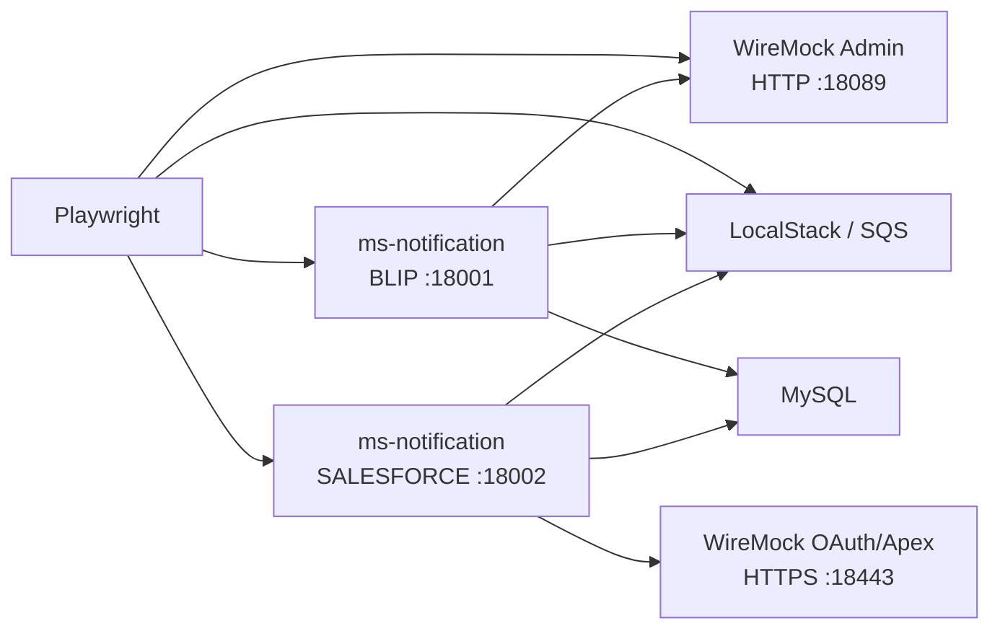

# Relatório técnico — testes Playwright de WhatsApp via Salesforce

## 1. Objetivo

Este relatório documenta a expansão do subprojeto `ms-notification-playwright-e2e`
para validar a migração do envio de WhatsApp para Salesforce Enhanced Messaging.
A implementação automatiza regras de contrato, compatibilidade, autenticação,
resiliência, filas, fallback e segurança, preservando também a regressão do provider
BLiP usado como rollback.

Foram adicionados 29 cenários Playwright Salesforce. Após a implementação, a suíte
local completa possui 68 testes e o projeto alvo `ms-notification` permanece com
build e 117 testes Maven aprovados.

## 2. Fontes utilizadas

A análise e a implementação foram orientadas pelas seguintes fontes:

- [tarefa no Notion — Create Playwright test case for whatsapp message using whatsapp](https://app.notion.com/p/3a4b3def3e7c8013b8f3d64d150a4d40);
- `docs/guia-testes-e2e-bdd-ms-notification-salesforce.md`;
- código-fonte local do `ms-notification`;
- padrões já existentes no `ms-notification-playwright-e2e`;
- testes unitários Salesforce já existentes no projeto Java.

As invariantes priorizadas foram:

1. `VOUCHER` envia somente `to` e `text`.
2. `APP_AUTH` envia `to`, `text` e `templateName` opcional.
3. Aceite exige simultaneamente HTTP `202` e `success=true`.
4. `correlationId` é a referência do provider.
5. O telefone chega ao Salesforce com exatamente um DDI `55`.
6. `0DDD` é rejeitado antes de qualquer dependência.
7. O primeiro `401` renova o token e repete uma vez; o segundo encerra o ciclo.
8. Falhas transitórias seguem para retry; falhas definitivas seguem para hospital.
9. No Voucher adhoc, SMS ocorre apenas depois de falha definitiva do WhatsApp.
10. Logs devem permitir rastreio sem token, segredo, telefone ou código completos.

## 3. Arquitetura do ambiente local

O ambiente anterior possuía uma única instância do `ms-notification` configurada com
BLiP. Alterar essa instância para Salesforce invalidaria a regressão existente. Por
isso, a solução mantém duas aplicações simultâneas:



As duas instâncias compartilham MySQL, LocalStack e WireMock. O Playwright usa um
worker no modo local, e as fixtures limpam mappings, requisições e filas antes de
cada cenário. Isso evita interferência entre casos mesmo com a infraestrutura
compartilhada.

### 3.1 HTTPS local fiel ao contrato

O código alvo rejeita `login-url` e `instance_url` sem HTTPS. Para não relaxar essa
regra no teste, o Docker Compose passou a gerar:

- keystore PKCS#12 para o servidor HTTPS do WireMock;
- certificado sintético com SAN para `wiremock`, `localhost` e `127.0.0.1`;
- truststore JKS montado somente na instância Salesforce.

O truststore do cliente usa JKS porque a imagem do projeto executa Java 11.0.10, que
não lê o algoritmo de integridade PKCS#12 produzido pelo JDK atual. O servidor
WireMock continua com PKCS#12. Os artefatos são gerados em volume Docker e não são
versionados.

## 4. Estrutura implementada

```text
ms-notification-playwright-e2e/
├── infra/
│   └── docker-compose.local.yml
├── scripts/
│   ├── run-local.sh
│   └── validate-env.ts
├── src/
│   ├── clients/
│   │   ├── mock-infra-client.ts
│   │   └── sqs-test-client.ts
│   ├── config/
│   │   └── environment.ts
│   ├── data/
│   │   └── payloads.ts
│   ├── fixtures/
│   │   └── api.ts
│   └── utils/
│       └── salesforce-test.ts
├── tests/
│   ├── 07-salesforce-whatsapp.spec.ts
│   ├── 08-salesforce-resilience.spec.ts
│   └── 09-salesforce-voucher-adhoc.spec.ts
└── docs/
    ├── guia-testes-e2e-bdd-ms-notification-salesforce.md
    ├── MATRIZ_CENARIOS.md
    └── RELATORIO_TECNICO_SALESFORCE_WHATSAPP_E2E.md
```

## 5. Implementações e decisões

### 5.1 Fixture dedicada ao Salesforce

A fixture `salesforceApiClient` cria um `APIRequestContext` direcionado para
`SALESFORCE_MS_NOTIFICATION_BASE_URL`. A fixture reutiliza o mesmo cliente de domínio
`MsNotificationClient`, evitando duplicação de endpoints e headers.

O token retornado pelo mock possui TTL de um segundo. A fixture aguarda sua expiração
antes de cada teste Salesforce para isolar o cache entre cenários sem reiniciar o
container. Dentro de um mesmo cenário, o TTL ainda permite comprovar cache e
single-flight.

### 5.2 Mocks dinâmicos do Salesforce

O `MockInfraClient` foi expandido com suporte a:

- resposta JSON ou corpo bruto;
- atraso controlado para timeout;
- prioridade de mapping;
- cenários stateful do WireMock;
- estado inicial e transição de estado.

Foram criados helpers para:

- OAuth Client Credentials;
- aceite dos endpoints Voucher e App Auth;
- respostas de falha configuráveis;
- sequência `401` seguida de `202`.

Os mappings validam `Content-Type`, formulário OAuth e header Bearer. As requisições
capturadas são usadas para conferir o contrato realmente emitido pela aplicação, e
não apenas o status público da API.

### 5.3 Utilitários de asserção

O arquivo `src/utils/salesforce-test.ts` centraliza:

- paths OAuth/Apex/SMS;
- espera por quantidade de chamadas;
- leitura do último payload Salesforce;
- espera por mensagens SQS;
- validação de fila vazia;
- validação de ausência de SMS.

Essa separação mantém as specs orientadas a comportamento e reduz detalhes de
infraestrutura dentro dos testes.

### 5.4 Inspeção de filas

O `SqsTestClient` passou a aceitar `waitTimeSeconds`, com leitura imediata por padrão.
Os cenários consultam as filas específicas de WhatsApp e validam que o retry contém:

- `id` original;
- telefone normalizado;
- mensagem canônica;
- `flow`;
- `provider=SALESFORCE`;
- `notificationType`;
- ausência de metadados exclusivos do BLiP.

### 5.5 Linguagem orientada ao negócio

Todos os testes novos possuem bloco JSDoc imediatamente acima da declaração. O texto
está em português do Brasil e descreve:

- valor protegido para o negócio;
- comportamento esperado;
- regras de retry, hospital, fallback ou segurança representadas.

Os títulos mantêm IDs rastreáveis ao guia, como `SF-F01`, `SF-R04` e `SF-S02/S03`.

## 6. Cobertura adicionada

### 6.1 Contrato, compatibilidade e segurança

O arquivo `tests/07-salesforce-whatsapp.spec.ts` cobre:

- Voucher aceito com payload mínimo;
- OAuth Client Credentials e Bearer;
- APP_AUTH com template padrão ou customizado;
- normalização de telefone local, `55` e `+55`;
- rejeição de `0DDD` sem efeitos colaterais;
- remoção de campos legados BLiP;
- resolução de alias histórico do código;
- cache e single-flight do token;
- tratamento idempotente;
- rastreabilidade e sanitização de logs;
- ausência de retry, hospital e SMS após aceite.

### 6.2 Resiliência

O arquivo `tests/08-salesforce-resilience.spec.ts` cobre:

- primeiro `401` seguido de renovação e aceite;
- segundo `401` sem terceira tentativa;
- hospital para `400` e `403`;
- retry para `429`, `500` e `503` temporário;
- hospital para `503` configuracional;
- timeout;
- resposta vazia;
- resposta sem `success`;
- `202` com `success=false`.

### 6.3 Voucher adhoc

O arquivo `tests/09-salesforce-voucher-adhoc.spec.ts` cobre:

- aceite pelo WhatsApp sem SMS;
- falha definitiva com SMS aceito;
- falha transitória sem SMS imediato;
- `voucherId` como último fallback do código;
- falha do Salesforce e do SMS com `FALLBACK_FAILED`.

## 7. Validações executadas

### 7.1 Projeto alvo

Comando:

```bash
cd ../ms-notification
mvn clean verify
mvn -Dtest=RouteasyServiceTeste test
```

Resultado:

- `BUILD SUCCESS`;
- 117 testes;
- 0 falhas;
- 0 erros;
- relatório JaCoCo gerado;
- JAR recompilado com sucesso.
- o teste legado `RouteasyServiceTeste`, fora do padrão de descoberta normal do
  Surefire, também foi executado explicitamente: 2 testes aprovados.

### 7.2 Projeto Playwright

Comandos:

```bash
npx tsc --noEmit
npm run lint:env
docker compose --env-file .env.local -f infra/docker-compose.local.yml config --quiet
docker compose --env-file .env.local -f infra/docker-compose.local.yml up -d --build
npm run test:local:no-docker
```

Resultados:

- TypeScript sem erros;
- variáveis local e Salesforce validadas;
- Docker Compose válido;
- duas aplicações com health `UP`;
- 68 testes Playwright aprovados;
- 0 falhas;
- execução em 52,5 segundos;
- regressão BLiP e novos fluxos Salesforce aprovados na mesma execução.

## 8. Como executar

O JAR do projeto alvo deve existir:

```bash
cd ../ms-notification
mvn clean verify
```

Depois:

```bash
cd ../PlaywrightSwitchCase/ms-notification-playwright-e2e
npm install
npm run test:local
```

Para manter os containers ativos:

```bash
npm run compose:up
npm run test:local:no-docker
npm run compose:logs
npm run compose:down
```

## 9. Limitações e riscos residuais

1. A idempotência é validada no comportamento do `ms-notification` diante de uma
   resposta idempotente simulada. A confirmação de uma única entrega física e da
   janela real de 60 minutos depende da sandbox Salesforce.
2. Os testes locais comprovam publicação nas filas, mas não executam consumidores
   externos nem processos operacionais posteriores.
3. Cenários destrutivos permanecem marcados como `@local-only`; eles não devem ser
   executados em HML compartilhado.
4. As pendências de segurança e implantação já registradas no guia — segredos
   históricos, configuração de pipeline, argumentos do container e filas ambientais —
   pertencem ao projeto alvo e não foram alteradas por esta implementação.
5. Entrega real no telefone e consulta de `ActiveMessageLog` continuam sendo
   evidências manuais de HML.

## 10. Conclusão

A suíte agora valida o Salesforce como provider principal sem sacrificar o rollback
BLiP. A arquitetura local reproduz OAuth e Apex sobre HTTPS, observa payloads reais,
inspeciona SQS e verifica fallback e logs. O resultado é uma regressão reproduzível,
orientada às regras do negócio e executável sem credenciais ou provedores externos.
