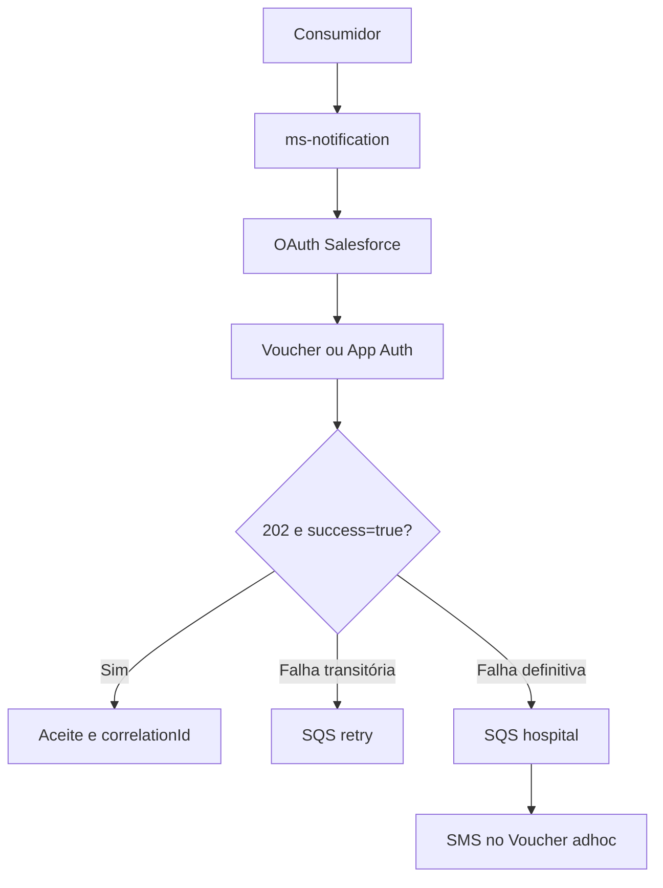

# Guia técnico de testes E2E e BDD — `ms-notification` com WhatsApp via Salesforce

## 1. Resumo executivo

Este guia define a validação funcional, de integração, resiliência, segurança e implantação da migração do envio de WhatsApp do provider BLiP para o Salesforce Enhanced Messaging no `ms-notification`. O escopo cobre os fluxos `VOUCHER` e `APP_AUTH`, OAuth 2.0 Client Credentials, cache e renovação de token, idempotência, normalização de telefone, filas SQS de retry/hospital, fallback SMS, rollback temporário para BLiP e propagação de configurações por argumentos Spring.

A análise encontrou uma divergência crítica entre o estado final declarado no relatório anexado e o snapshot atual do projeto no Google Drive. Embora o relatório informe que os YAMLs não possuem mais credenciais e que a implementação está concluída, os arquivos atuais ainda contêm valores sensíveis versionados; o `buildspec.yml` ainda executa `env`; o `Dockerfile` usa `ENTRYPOINT` em shell form; o `deployment.yml` não declara `args`; e as filas específicas de WhatsApp ainda possuem defaults com sufixo `-dev` no arquivo base. Portanto, a execução contra HML deve permanecer bloqueada até a correção e rotação dos segredos.

O guia separa:

- testes E2E reais e não destrutivos em HML;
- testes controlados de falha com mock/stub;
- verificações de configuração e implantação;
- testes de segurança e observabilidade;
- regressão automatizada antes e depois da execução manual.

## 2. Identificação e objetivo

| Campo | Valor |
| --- | --- |
| Projeto | `ms-notification` |
| Referência funcional | `STRY0048888` |
| Mudança | WhatsApp via Salesforce Enhanced Messaging |
| Ambiente-alvo | HML/Sandbox Salesforce |
| Canal primário do Voucher | WhatsApp |
| Contingência do Voucher adhoc | SMS após falha definitiva |
| Fluxos Salesforce | `VOUCHER` e `APP_AUTH` |
| API pública principal | `POST /notification/v1/whatsapp` |
| API adhoc | `POST /notification/v1/vouchers/adhoc` |
| Objetivo do guia | Homologar integralmente a solução e produzir evidência auditável |

## 3. Fontes e metodologia

### 3.1 Fontes analisadas

#### Notion

- [`[task] Issue to send the message using whatsapp`](https://app.notion.com/p/3a4b3def3e7c80f0b5a8cff2c2ac7507)
- [`[task] Change the Notification to send whatsapp message using Salesforce`](https://app.notion.com/p/39eb3def3e7c809cb98bf678ea48455a)
- [`[task] Issue Salesforce Credentials`](https://app.notion.com/p/3a6b3def3e7c8006b4b1d655ed046f88)

#### Google Drive e código-fonte

- [Pasta `ms-notification`](https://drive.google.com/drive/folders/1zoMZeThCb2RUQFawLGjlMBqc63USbLng)
- [`README.md`](https://drive.google.com/file/d/1kEyRV_JalWcUqCP6jxvStmtq4onnFbmt/view)
- [`WhatsappNotificationService.java`](https://drive.google.com/file/d/1AbD6JSTLYsCuezvjsiCLr1xl5ExOP-uQ/view)
- [`VoucherAdhocNotificationService.java`](https://drive.google.com/file/d/1gW2CM1ktXxP5pt3qLdGNESduVKX-a5aH/view)
- [`SalesforceWhatsappClient.java`](https://drive.google.com/file/d/1cCx_921Xwj6w3TmClCAfp4djfOJ_82Fc/view)
- [`SalesforceOAuthClient.java`](https://drive.google.com/file/d/1OnsNk-K1YCfaTYmfiAit3dxJqcxSi58L/view)
- [`SalesforceAccessTokenProvider.java`](https://drive.google.com/file/d/19JbSTTub-efoFgCMzDCZJaus3Wx9d3Sg/view)
- [`SalesforceWhatsappProperties.java`](https://drive.google.com/file/d/1eJxjM9TENSx6D4Jchf0s2IiOQ6YpnOeo/view)
- [`SalesforceWhatsappMapper.java`](https://drive.google.com/file/d/1eG8Thvs2xQzZY-1Hf4SgjR0uewZN82E4/view)
- [`WhatsappPhoneNumberNormalizer.java`](https://drive.google.com/file/d/1iM1d4emKrr8Ut1Qi8nCrB3habj8sg4Og/view)
- [`VoucherCodeResolver.java`](https://drive.google.com/file/d/1wOuTPjhmG2uiFice2xvDO1NZJFAYTirY/view)
- [`SQSClient.java`](https://drive.google.com/file/d/1Z2RZ35_xYkE2zTUdVkV67zLWsbTzzWGt/view)
- [`application.yml`](https://drive.google.com/file/d/1KoXQbGat77RrY80lU1rBKlqDAU8MHrRH/view)
- [`application-hml.yml`](https://drive.google.com/file/d/15nU6h-8OK9KMlBNvlfCh9uIYqwxkKrG9/view)
- [`deployment.yml`](https://drive.google.com/file/d/1-F9MeElawOsMNJaPKo_uOQt0lVLw8JML/view)
- [`swagger-notification-api.yaml`](https://drive.google.com/file/d/1bfxeptSuWz_FGhnUFQqn4CpV9YBSDLVX/view)

#### Anexo principal

- `RELATORIO_TECNICO_MIGRACAO_WHATSAPP_SALESFORCE_STRY0048888.md`

### 3.2 Escopo incluído

- contrato HTTP público;
- integração OAuth e Apex REST;
- payloads Salesforce;
- seleção de provider;
- classificação de erros;
- retry e hospital em SQS;
- fallback SMS;
- idempotência;
- observabilidade;
- segurança de configuração;
- execução local controlada;
- implantação e smoke test em HML;
- regressão do rollback BLiP.

### 3.3 Escopo excluído

Os anexos relacionados a `ms-payment`, Malga e Sensedia não pertencem à cadeia causal da migração do `ms-notification`. O arquivo sobre BLiP foi considerado apenas como contexto histórico do provider anterior.

## 4. Síntese técnica do comportamento esperado



### 4.1 Regras invariantes

1. `VOUCHER` é o fluxo padrão.
2. Voucher envia somente `to` e `text`.
3. `APP_AUTH` envia `to`, `text` e `templateName` opcional.
4. A mensagem só é aceita quando o provider retorna `HTTP 202` e `success=true`.
5. O `correlationId` é armazenado como `providerMessageId`.
6. Um `202` aceito nunca gera retry local.
7. `401` invalida o token e permite apenas uma nova tentativa.
8. `429`, timeout, conexão, resposta inválida e falhas transitórias `5xx` geram retry.
9. `400`, `403`, segundo `401` e `503` configuracional geram hospital.
10. No Voucher adhoc, SMS só é enviado após falha definitiva.
11. Retry de WhatsApp não pode disparar SMS imediato.
12. Telefone deve chegar ao Salesforce com exatamente um DDI `55`.
13. O formato `0DDD` deve ser rejeitado.
14. Repetições equivalentes dentro de 60 minutos devem manter o mesmo `correlationId`.
15. Token, segredo, código completo e telefone completo não podem aparecer nos logs.

## 5. Achados e bloqueadores antes do teste

### 5.1 Bloqueadores P0

| ID | Achado confirmado no snapshot atual | Risco | Condição para liberar |
| --- | --- | --- | --- |
| B01 | Valores sensíveis ainda estão presentes em YAMLs | Comprometimento de Salesforce, banco, SMS, AWS e outros serviços | Remover, sanear histórico e rotacionar todos os segredos |
| B02 | `buildspec.yml` ainda executa `env` | Vazamento no log do pipeline | Remover o comando e revisar logs anteriores |
| B03 | `application.yml` mantém defaults `-dev` para filas WhatsApp | HML publica na fila errada ou inexistente | Remover defaults ambientais do arquivo base |
| B04 | `deployment.yml` possui `envFrom`, mas não declara `args` | Argumentos Spring podem não chegar ao processo | Validar o mecanismo real e declarar configuração determinística |
| B05 | `Dockerfile` usa shell form e coloca opção JVM após `-jar` | Ordem e propagação de parâmetros ambíguas | Usar exec form e opções JVM antes de `-jar` |
| B06 | Não há evidência de fail-fast global de configuração | Pod pode ficar pronto sem Salesforce utilizável | Implementar e testar validação de startup |

### 5.2 Riscos P1

| ID | Risco | Validação exigida |
| --- | --- | --- |
| RSK01 | Falha de publicação em SQS mascara a falha original | Cenário de indisponibilidade da fila com log/métrica explícitos |
| RSK02 | Não há API pública de consulta de entrega | Consulta operacional pelo `correlationId` no Salesforce |
| RSK03 | Retries após 60 minutos podem gerar duplicidade | Confirmar política de retry ou idempotência própria |
| RSK04 | `templateName` pode não compor a chave de deduplicação | Validar com o time Salesforce |
| RSK05 | HML não possui evidência centralizada suficiente | Garantir logs pesquisáveis por `transactionId` |

## 6. Estratégia de testes

### 6.1 Camadas

| Camada | Objetivo | Ambiente |
| --- | --- | --- |
| Unitário | Validar mapper, cache, normalizador e classificação | CI/local |
| Integração controlada | Forçar códigos HTTP, timeout e respostas inválidas | Local/CI com stub |
| Contrato | Confirmar payload, headers, status e schemas | Stub + HML |
| E2E real | Confirmar OAuth, aceite Salesforce e entrega | HML/Sandbox |
| Implantação | Confirmar args/env, profile, filas e probes | Cluster HML |
| Segurança | Impedir segredos em código, processo e logs | CI + HML |
| Rollback | Garantir retorno temporário ao BLiP | Ambiente isolado |

### 6.2 Regra para cenários destrutivos

Não provoque `429`, `500`, timeout, credencial inválida, fila inexistente ou indisponibilidade do Salesforce em HML compartilhado sem autorização. Esses cenários devem usar WireMock, MockServer, proxy de falhas ou sandbox dedicada.

## 7. Pré-requisitos

### 7.1 Pessoas e acessos

- responsável pelo `ms-notification`;
- responsável pela sandbox Salesforce;
- acesso somente leitura aos logs e métricas;
- acesso autorizado às filas SQS de HML;
- número de telefone de teste com consentimento;
- cliente OAuth da API corporativa;
- credenciais Salesforce novas e armazenadas em Vault/Secret;
- permissão para consultar `ActiveMessageLog` pelo `correlationId`.

### 7.2 Infraestrutura

- imagem do commit candidato identificada por digest;
- profile `hml`;
- Connected App habilitada para Client Credentials;
- paths Apex REST publicados;
- templates Voucher e App Auth ativos;
- filas WhatsApp retry/hospital existentes na conta e região corretas;
- banco acessível pelo pod;
- egress, DNS e TLS liberados para Salesforce;
- centralização de logs habilitada.

### 7.3 Variáveis de trabalho

Use apenas referências ou placeholders. Não copie segredos para o relatório ou terminal compartilhado.

```bash
export BASE_URL='https://api.sandbox.ultragaz.com/notification/v1'
export API_ACCESS_TOKEN='<token-da-api>'
export TEST_PHONE='<numero-autorizado>'
export TEST_PHONE_55='<55+numero-autorizado>'
export TEST_PHONE_PLUS_55='<+55+numero-autorizado>'
export TEST_VOUCHER_CODE='E2E1234'
export TEST_APP_CODE='482913'
export TX_PREFIX="E2E-WA-$(date +%Y%m%d%H%M%S)"
```

## 8. Preparação e validação automatizada

No clone integral do projeto:

```bash
mvn clean verify
```

Critério:

- build concluído;
- nenhum teste falho;
- relatório JaCoCo gerado;
- testes do Salesforce, services, controllers e rollback executados.

O arquivo legado `RouteasyServiceTeste` não segue o padrão comum do Surefire. Até que seja renomeado, execute-o explicitamente:

```bash
mvn -Dtest=RouteasyServiceTeste test
```

### 8.1 Testes existentes que sustentam a regressão

- `SalesforceOAuthClientTest`
- `SalesforceAccessTokenProviderTest`
- `SalesforceWhatsappClientTest`
- `SalesforceWhatsappMapperTest`
- `WhatsappNotificationServiceTest`
- `VoucherAdhocNotificationServiceTest`
- `WhatsappClientServiceTest`
- `WhatsappNotificationControllerTest`
- `VoucherAdhocNotificationControllerTest`
- `BlipWhatsappProviderClientTest`

### 8.2 Testes automatizados adicionais necessários

- `SalesforceWhatsappCommandLineBindingTest`;
- `WhatsappRuntimeConfigurationValidatorTest`;
- teste de precedência de argumento sobre YAML;
- teste de fila `-dev` proibida no profile HML;
- teste de falha de publicação SQS;
- teste de sanitização de logs;
- teste de propagação de `args` no manifest renderizado.

## 9. Verificação segura da implantação

### 9.1 Renderizar argumentos sem exibir valores

```bash
kubectl -n <namespace> get deploy ms-notification -o json |
  jq -r '.spec.template.spec.containers[]
    | select(.name=="ms-notification")
    | .args[]?
    | sub("=.*$"; "=<redacted>")'
```

Esperado:

- profile HML;
- provider `SALESFORCE`;
- paths Voucher e App Auth;
- TTL, skew e timeouts;
- filas específicas de WhatsApp;
- nenhum segredo exposto em argumentos.

Client ID e Client Secret devem permanecer em Secret/Vault e chegar como variáveis, não como texto literal no manifest.

### 9.2 Confirmar presença sem imprimir conteúdo

```bash
kubectl -n <namespace> exec deploy/ms-notification -- sh -c '
for name in SALESFORCE_LOGIN_URL SALESFORCE_CLIENT_ID SALESFORCE_CLIENT_SECRET \
NOTIFICATION_WHATSAPP_QUEUE_RETRY NOTIFICATION_WHATSAPP_QUEUE_HOSPITAL; do
  eval "value=\${$name:-}"
  if [ -n "$value" ]; then
    echo "$name=PRESENTE"
  else
    echo "$name=AUSENTE"
  fi
done'
```

Não execute `env`, `printenv` ou comandos equivalentes em ambientes compartilhados.

### 9.3 Smoke test

```bash
kubectl -n <namespace> rollout status deploy/ms-notification --timeout=180s
kubectl -n <namespace> get pods -l app.kubernetes.io/name=ms-notification
curl -i "$BASE_URL/actuator/health"
```

Esperado:

- rollout concluído;
- readiness e liveness aprovadas;
- health `UP`;
- nenhuma tentativa de conexão com fila `-dev`;
- startup interrompido de forma sanitizada se configuração obrigatória estiver ausente.

## 10. Chamadas de referência

### 10.1 Voucher no endpoint geral

```bash
TX_ID="${TX_PREFIX}-VOUCHER"

curl -i -X POST "$BASE_URL/whatsapp" \
  -H "Authorization: Bearer $API_ACCESS_TOKEN" \
  -H "Content-Type: application/json" \
  -H "Accept-Language: pt_BR" \
  -H "Credentials-Alias: vouchers" \
  --data "{
    \"transactionId\":\"$TX_ID\",
    \"cellPhone\":\"$TEST_PHONE\",
    \"message\":\"$TEST_VOUCHER_CODE\",
    \"flow\":\"VOUCHER\",
    \"notificationType\":\"SELL\",
    \"extraInfo\":{\"Origem\":\"E2E\",\"Caso\":\"F01\"}
  }"
```

Esperado: `HTTP 202` e corpo vazio. O resultado interno deve ser comprovado nos logs e no Salesforce.

### 10.2 App Auth

```bash
TX_ID="${TX_PREFIX}-APP-AUTH"

curl -i -X POST "$BASE_URL/whatsapp" \
  -H "Authorization: Bearer $API_ACCESS_TOKEN" \
  -H "Content-Type: application/json" \
  -H "Accept-Language: pt_BR" \
  --data "{
    \"transactionId\":\"$TX_ID\",
    \"cellPhone\":\"$TEST_PHONE\",
    \"message\":\"$TEST_APP_CODE\",
    \"flow\":\"APP_AUTH\",
    \"templateName\":\"envio_codigo_autenticacao_app\",
    \"extraInfo\":{\"Origem\":\"E2E\",\"Caso\":\"F03\"}
  }"
```

### 10.3 Voucher adhoc

```bash
TX_ID="${TX_PREFIX}-ADHOC"

curl -i -X POST "$BASE_URL/vouchers/adhoc" \
  -H "Authorization: Bearer $API_ACCESS_TOKEN" \
  -H "Content-Type: application/json" \
  -H "Accept-Language: pt_BR" \
  -H "Credentials-Alias: vouchers" \
  --data "{
    \"transactionId\":\"$TX_ID\",
    \"voucherId\":\"$TEST_VOUCHER_CODE\",
    \"cellPhone\":\"$TEST_PHONE\",
    \"notificationType\":\"SELL\",
    \"primaryChannel\":\"WHATSAPP\",
    \"fallbackChannel\":\"SMS\",
    \"origin\":\"GESTAO_VG\",
    \"extraInfo\":{\"Origem\":\"E2E\",\"Caso\":\"F10\"}
  }"
```

## 11. Catálogo de cenários

### 11.1 Funcional e contrato

| ID | Cenário | Resultado principal |
| --- | --- | --- |
| F01 | Voucher aceito | `202`, `success=true`, `correlationId`, sem SMS |
| F02 | App Auth sem override | Template padrão do Salesforce |
| F03 | App Auth com override | `templateName` propagado |
| F04 | Repetição idempotente | Mesmo `correlationId`, uma entrega |
| F05 | Telefone local, `55` e `+55` | Exatamente um DDI `55` |
| F06 | Telefone `0DDD` | `400`, sem chamada externa |
| F07 | Campos obrigatórios ausentes | `400`, sem SQS nem provider |
| F08 | Metadados legados no Voucher | Não chegam ao Salesforce |
| F09 | Aliases legados de código | Código canônico em `text` |
| F10 | Voucher adhoc somente com `voucherId` | Código resolvido e mensagem SMS padrão disponível |
| F11 | Contrato assíncrono `/whatsapp` | `202` com corpo vazio |
| F12 | Resposta adhoc aceita | Status `ACCEPTED`, canal enviado `WHATSAPP` |

### 11.2 OAuth, resiliência e filas

| ID | Cenário | Resultado principal |
| --- | --- | --- |
| R01 | OAuth com sucesso | `200`, Bearer usado sem logar token |
| R02 | Cache de token | Reuso até o limite de renovação |
| R03 | Concorrência | Uma autenticação para chamadores simultâneos |
| R04 | Primeiro `401` e segunda chamada aceita | Renova e repete uma vez |
| R05 | Segundo `401` | Hospital; sem loop |
| R06 | `400` do Apex | Hospital; SMS no adhoc |
| R07 | `403` do Apex | Hospital; SMS no adhoc |
| R08 | `429` | Retry; sem SMS |
| R09 | `500` | Retry; sem SMS |
| R10 | `503` temporário | Retry; sem SMS |
| R11 | `503` de configuração | Hospital; SMS no adhoc |
| R12 | Timeout/conexão | Retry; sem SMS |
| R13 | Resposta vazia/inválida | Retry controlado |
| R14 | `202` com `success=false` | Não aceitar; hospital |
| R15 | Retry posteriormente aceito | Aceite sem duplicidade |
| R16 | Fila retry indisponível | Erro operacional explícito |
| R17 | Fila hospital indisponível | Erro operacional explícito |
| R18 | SMS fallback aceito | `FALLBACK_SENT` |
| R19 | SMS fallback rejeitado | `FALLBACK_FAILED` |

### 11.3 Configuração, implantação e segurança

| ID | Cenário | Resultado principal |
| --- | --- | --- |
| C01 | Binding por argumentos Spring | Todas as propriedades vinculadas |
| C02 | Precedência de argumentos | Argumento prevalece sobre YAML |
| C03 | Configuração Salesforce ausente | Startup falha de forma sanitizada |
| C04 | URL não HTTPS/malformada | Startup falha |
| C05 | TTL/skew/timeouts inválidos | Startup falha |
| C06 | Fila vazia em HML | Startup falha |
| C07 | Fila `-dev` em HML | Startup falha |
| C08 | `args` efetivos no pod | Configuração chega ao processo |
| C09 | Rollback `BLIP` | Salesforce não bloqueia a inicialização |
| C10 | Docker exec form | Args anexados após o JAR |
| S01 | Varredura de segredos | Nenhum segredo em fonte/artefato |
| S02 | Logs sanitizados | Sem token, secret, código ou telefone completo |
| S03 | Rastreabilidade | Cadeia completa por `transactionId`/`correlationId` |
| S04 | Pipeline seguro | Sem `env` e com secret scanning |
| S05 | Nenhum retry após aceite | Zero mensagem local após `202` aceito |

## 12. Especificações BDD

### 12.1 Feature: envio Voucher e App Auth

```gherkin
Funcionalidade: Enviar mensagens de WhatsApp pelo Salesforce

  Contexto:
    Dado que o provider configurado é "SALESFORCE"
    E que OAuth, templates e filas de HML estão válidos
    E que o telefone usado no teste está autorizado

  Cenário: F01 - Enviar Voucher aceito
    Dado um Voucher com código novo e transactionId único
    Quando o consumidor chamar POST /notification/v1/whatsapp com flow "VOUCHER"
    Então a API deve responder HTTP 202 com corpo vazio
    E o Salesforce deve receber somente "to" e "text"
    E deve retornar success igual a true e um correlationId
    E não deve existir retry, hospital ou SMS para o transactionId

  Cenário: F02 - Enviar App Auth com template padrão
    Dado uma requisição APP_AUTH com código válido e sem templateName
    Quando a requisição for processada
    Então o endpoint App Auth deve ser chamado
    E o Salesforce deve selecionar o template padrão
    E a solicitação aceita deve possuir correlationId

  Cenário: F03 - Enviar App Auth com template customizado
    Dado uma requisição APP_AUTH com templateName válido
    Quando a requisição for processada
    Então templateName deve ser enviado ao endpoint App Auth
    E a solicitação deve ser aceita sem fallback SMS

  Cenário: F04 - Deduplicar solicitação repetida
    Dado uma solicitação já aceita pelo Salesforce
    Quando o mesmo fluxo, telefone normalizado e texto forem enviados dentro de 60 minutos
    Então a resposta deve ser tratada como sucesso idempotente
    E o correlationId deve ser o mesmo
    E somente uma mensagem deve ser entregue

  Esquema do Cenário: F05 - Normalizar telefone brasileiro
    Dado o telefone "<entrada>"
    Quando a mensagem for enviada
    Então o campo "to" deve conter o telefone com exatamente um DDI 55

    Exemplos:
      | entrada             |
      | DDD + número local  |
      | 55 + DDD + número   |
      | +55 + DDD + número  |

  Cenário: F06 - Rejeitar prefixo de operadora 0DDD
    Dado um telefone iniciado por 0DDD
    Quando a API receber a requisição
    Então deve responder HTTP 400
    E não deve solicitar token
    E não deve publicar em retry ou hospital

  Cenário: F08 - Ignorar campos legados no Voucher
    Dado um Voucher com templateName, templateId, idioma e templateVariables legados
    Quando a mensagem for mapeada para Salesforce
    Então o payload externo deve conter somente "to" e "text"
    E nenhum campo BLiP deve ser propagado
```

### 12.2 Feature: resolução de código e Voucher adhoc

```gherkin
Funcionalidade: Preservar compatibilidade e fallback do Voucher adhoc

  Esquema do Cenário: F09 - Resolver aliases legados
    Dado que o código está no alias "<alias>"
    Quando o Voucher for enviado
    Então o valor deve ser convertido para o campo "text" do Salesforce

    Exemplos:
      | alias        |
      | codigoVale   |
      | voucherCode  |
      | 0            |
      | 1            |
      | codigo       |
      | code         |

  Cenário: F10 - Usar voucherId como último fallback
    Dado um Voucher adhoc sem mensagem e sem templateVariables
    E com voucherId válido
    Quando a requisição for processada
    Então voucherId deve ser usado como código do Voucher
    E uma mensagem SMS padrão deve estar disponível caso o fallback seja necessário

  Cenário: R18 - Enviar SMS após falha definitiva
    Dado que o Salesforce rejeitou definitivamente o Voucher
    Quando o fluxo adhoc processar a falha
    Então a falha do WhatsApp deve ser hospitalizada
    E o SMS deve ser enviado uma única vez
    E a resposta deve ter status "FALLBACK_SENT"

  Cenário: R19 - Informar falha de ambos os canais
    Dado que o Salesforce falhou definitivamente
    E que o SMS também não foi aceito
    Quando o fluxo adhoc terminar
    Então a resposta deve ter status "FALLBACK_FAILED"
    E os status dos dois canais devem ser rastreáveis
```

### 12.3 Feature: OAuth, cache e renovação

```gherkin
Funcionalidade: Autenticar no Salesforce com segurança e eficiência

  Cenário: R01 - Obter token por Client Credentials
    Dado que a Connected App e as credenciais estão válidas
    Quando o primeiro envio solicitar autenticação
    Então o token endpoint deve receber application/x-www-form-urlencoded
    E o grant_type deve ser client_credentials
    E a resposta deve conter access_token e instance_url HTTPS
    E token e segredo não devem aparecer nos logs

  Cenário: R02 - Reutilizar token em cache
    Dado um token ainda utilizável
    Quando duas mensagens sequenciais forem enviadas
    Então o token endpoint deve ser chamado apenas na primeira mensagem

  Cenário: R03 - Evitar renovações concorrentes
    Dado que não existe token em cache
    Quando múltiplos envios simultâneos iniciarem
    Então apenas uma chamada OAuth deve ocorrer
    E todos os envios devem usar o token válido obtido

  Cenário: R04 - Renovar após primeiro 401
    Dado que a primeira chamada Apex retorna 401
    Quando o client invalidar o token
    Então um novo token deve ser obtido
    E a chamada Apex deve ser repetida uma única vez
    E a segunda resposta aceita deve encerrar o fluxo

  Cenário: R05 - Não repetir indefinidamente
    Dado que a chamada repetida também retorna 401
    Quando a segunda falha ocorrer
    Então não deve haver terceira tentativa
    E a falha deve seguir para hospital
```

### 12.4 Feature: classificação de erros

```gherkin
Funcionalidade: Classificar falhas entre retry e hospital

  Esquema do Cenário: R06/R07 - Hospitalizar falha definitiva
    Dado que o Apex retorna HTTP "<status>"
    Quando a falha for classificada
    Então uma mensagem deve ser publicada na fila hospital de HML
    E não deve ser publicada na fila retry
    E o Voucher adhoc deve tentar SMS

    Exemplos:
      | status |
      | 400    |
      | 403    |

  Esquema do Cenário: R08/R09 - Agendar falha transitória
    Dado que o provider retorna HTTP "<status>"
    Quando a falha for classificada
    Então uma mensagem canônica deve ser publicada na fila retry de HML
    E nenhum SMS deve ser enviado imediatamente

    Exemplos:
      | status |
      | 429    |
      | 500    |

  Cenário: R10 - Tratar 503 temporário
    Dado que o Salesforce informa indisponibilidade temporária
    Quando a resposta 503 for classificada
    Então a mensagem deve seguir para retry
    E nenhum SMS deve ser enviado imediatamente

  Cenário: R11 - Tratar 503 configuracional
    Dado que o erro 503 informa fluxo, canal ou template não configurado
    Quando a resposta for classificada
    Então a mensagem deve seguir para hospital
    E o Voucher adhoc deve tentar SMS

  Cenário: R12 - Tratar timeout ou falha de conexão
    Dado que o provider não retorna resposta dentro do timeout
    Quando ocorrer ResourceAccessException
    Então a mensagem deve seguir para retry
    E o SMS não deve ser enviado imediatamente

  Cenário: R13 - Tratar resposta vazia ou inválida
    Dado que o Salesforce retorna corpo vazio ou sem campo success
    Quando o client validar a resposta
    Então a falha deve ser controlada
    E a mensagem deve seguir para retry

  Cenário: R14 - Exigir 202 e success true
    Dado que o Salesforce retorna 202 com success false
    Quando a resposta for avaliada
    Então a solicitação não deve ser considerada aceita
    E deve seguir para hospital
```

### 12.5 Feature: configuração e implantação

```gherkin
Funcionalidade: Materializar configurações válidas no processo Java

  Cenário: C01 - Vincular argumentos Spring
    Dado que os argumentos notification.whatsapp.salesforce.* foram declarados
    Quando o ApplicationContext iniciar
    Então SalesforceWhatsappProperties deve conter os valores esperados
    E provider e filas específicas devem ser vinculados

  Cenário: C02 - Aplicar precedência do argumento
    Dado que YAML e argumento possuem valores diferentes para a mesma propriedade
    Quando a aplicação iniciar
    Então o argumento deve prevalecer

  Cenário: C03 - Falhar sem configuração obrigatória
    Dado que o provider é SALESFORCE
    E que Client ID ou Client Secret está ausente
    Quando o pod iniciar
    Então o startup deve falhar
    E a mensagem deve citar somente a propriedade ausente
    E nenhum valor sensível deve ser registrado

  Cenário: C04 - Rejeitar URL insegura
    Dado uma login-url HTTP ou malformada
    Quando a aplicação iniciar
    Então o startup deve falhar com mensagem sanitizada

  Cenário: C05 - Rejeitar cache ou timeout inválido
    Dado TTL menor ou igual a zero, skew inválido ou timeout menor ou igual a zero
    Quando a aplicação iniciar
    Então o startup deve falhar antes de receber tráfego

  Cenário: C07 - Proibir fila DEV em HML
    Dado o profile hml
    E uma fila WhatsApp com sufixo -dev
    Quando a aplicação iniciar
    Então o startup deve falhar

  Cenário: C09 - Permitir rollback BLiP
    Dado o provider BLIP em ambiente de rollback isolado
    Quando a aplicação iniciar
    Então a ausência de propriedades Salesforce não deve bloquear o startup
    E o adapter BLiP deve receber o contexto legado necessário
```

### 12.6 Feature: segurança e observabilidade

```gherkin
Funcionalidade: Proteger segredos e fornecer rastreabilidade

  Cenário: S01 - Não versionar segredos
    Dado o commit candidato e seus artefatos
    Quando a varredura de segredos for executada
    Então nenhum segredo real deve ser encontrado

  Cenário: S02 - Sanitizar logs
    Dado um envio aceito e um envio rejeitado
    Quando os logs forem consultados
    Então devem existir transactionId, provider, flow, status e correlationId quando disponível
    E não devem existir token, Client Secret, código completo ou telefone completo

  Cenário: S03 - Rastrear ponta a ponta
    Dado um transactionId único
    Quando a mensagem for enviada
    Então o mesmo transactionId deve aparecer no início, resultado e eventual fila
    E o correlationId deve permitir localizar a solicitação no Salesforce

  Cenário: S05 - Não reenviar depois do aceite
    Dado que o Salesforce respondeu 202 e success true
    Quando o processamento local terminar
    Então não deve existir evento de retry
    E não deve existir evento de hospital
    E não deve existir fallback SMS
```

## 13. Procedimento manual por grupo

### 13.1 Sucesso real em HML

1. Gere um `transactionId` único.
2. Envie F01, F02, F03 e F10.
3. Registre status, tempo e headers da API.
4. Pesquise o `transactionId` nos logs.
5. Capture o `correlationId`.
6. Consulte `ActiveMessageLog` no Salesforce.
7. Confirme recebimento no telefone autorizado.
8. Verifique que não houve retry, hospital ou SMS indevido.
9. Anexe evidências com dados pessoais mascarados.

### 13.2 Idempotência

1. Execute F01 com código e telefone novos.
2. Aguarde o aceite e capture o `correlationId`.
3. Reenvie exatamente o mesmo fluxo, telefone e texto dentro de 60 minutos.
4. Confirme o mesmo `correlationId`.
5. Confirme apenas uma entrega no telefone.
6. Confirme `idempotent=true` ou mensagem equivalente nos logs.
7. Confirme ausência de retry.

### 13.3 Teste controlado de falhas

Configure o endpoint do provider para um stub HTTPS controlado. O stub deve permitir:

- OAuth `200`, `400`, `401`, `429` e timeout;
- Apex `202`, `400`, `401`, `403`, `429`, `500` e `503`;
- resposta vazia;
- `202` com `success=false`;
- primeira chamada `401` e segunda `202`;
- duas chamadas consecutivas `401`.

Para cada cenário:

1. limpe apenas o estado do stub;
2. gere um novo `transactionId`;
3. configure a resposta;
4. envie a requisição;
5. conte chamadas OAuth e Apex;
6. inspecione retry/hospital;
7. confirme a regra do SMS;
8. restaure o stub ao estado neutro.

### 13.4 Inspeção de filas

Prefira métricas e logs do produtor/consumidor. Se for necessário inspecionar a fila diretamente, use uma operação que não exclua a mensagem e siga o procedimento operacional da equipe.

Validar no payload de retry:

- `id`/`transactionId` original;
- telefone normalizado;
- mensagem/código canônico;
- `flow`;
- `provider`;
- `notificationType`;
- template App Auth quando aplicável;
- ausência de campos nulos;
- metadados BLiP apenas no rollback.

Validar no hospital:

- assunto e corpo sanitizados;
- telefone mascarado;
- mensagem/código mascarados;
- classificação correta da falha;
- nenhuma credencial.

### 13.5 Falha de publicação SQS

Somente em ambiente isolado:

1. configure uma fila inexistente ou negue temporariamente `sqs:SendMessage`;
2. gere uma falha que deveria produzir retry;
3. confirme erro de domínio/operacional explícito;
4. confirme log com `transactionId`, categoria da fila, região e código AWS;
5. confirme métrica e alerta;
6. confirme que o payload sensível não foi registrado;
7. restaure a permissão/fila.

Se o código ainda apenas propagar a exceção bruta do SDK, o cenário deve falhar e permanecer como pendência P1.

## 14. Verificações de segurança

### 14.1 Repositório e artefatos

Use uma ferramenta de secret scanning com redação:

```bash
gitleaks detect --redact --no-banner
```

Também inspecione:

- histórico Git;
- JAR e arquivos de resources;
- imagem Docker;
- manifests renderizados;
- artefatos do pipeline;
- páginas e anexos históricos;
- logs do pipeline.

### 14.2 Logs da aplicação

```bash
kubectl -n <namespace> logs deploy/ms-notification --since=30m |
  rg -i 'access[_-]?token|client[_-]?secret|authorization:|password|api[_-]?key'
```

Esperado: nenhuma ocorrência com valor sensível.

Faça uma segunda inspeção por padrões de telefone e códigos usados no teste. Os valores completos não devem aparecer.

### 14.3 Pipeline

Critérios:

- ausência do comando `env`;
- secrets fornecidos pelo mecanismo aprovado;
- nenhuma credencial em argumentos visíveis no processo;
- secret scanning bloqueando o build;
- imagem identificada por digest, não apenas `latest`;
- rotação concluída e documentada sem registrar os novos valores.

## 15. Evidências obrigatórias

| Evidência | Conteúdo mínimo | Regra de proteção |
| --- | --- | --- |
| Requisição | endpoint, timestamp, `transactionId`, cenário | Mascarar telefone e código |
| Resposta API | status, headers relevantes, corpo | Remover token |
| Log local | eventos e estágios | Sem segredos/PII |
| Salesforce | `correlationId`, fluxo e status operacional | Sem token |
| SQS | fila correta e payload estrutural | Mascarar conteúdo |
| SMS/WhatsApp | confirmação de recebimento | Mascarar número e código |
| Implantação | digest da imagem, profile e nomes das propriedades | Não mostrar valores |
| Segurança | resultado do scanner | Usar modo redacted |

Convenção sugerida:

```text
[ID]_[AAAA-MM-DD]_[transactionId]_[tipo].ext
```

## 16. Matriz de rastreabilidade

| Requisito/mudança | Cenários |
| --- | --- |
| Provider Salesforce | F01, F02, F03, C01 |
| OAuth Client Credentials | R01–R05 |
| Cache e single-flight | R02, R03 |
| Voucher payload mínimo | F01, F08, F09 |
| App Auth e template opcional | F02, F03 |
| Aceite estrito | F01, R13, R14 |
| Idempotência | F04, R15, S05 |
| Normalização de telefone | F05, F06 |
| Retry transitório | R08–R10, R12, R13 |
| Hospital definitivo | R05–R07, R11, R14 |
| Fallback SMS | R06, R07, R11, R18, R19 |
| Filas específicas de HML | C06, C07, R16, R17 |
| Argumentos Spring | C01, C02, C08, C10 |
| Fail-fast | C03–C07 |
| Rollback BLiP | C09 |
| Segurança | S01, S02, S04 |
| Observabilidade | S02, S03 |

## 17. Critérios de entrada

O ciclo E2E só pode começar quando:

- B01 a B06 estiverem resolvidos ou formalmente aceitos;
- credenciais expostas estiverem revogadas;
- o commit candidato estiver congelado;
- a imagem estiver identificada por digest;
- build e regressão estiverem verdes;
- Connected App e templates estiverem válidos;
- filas HML existirem;
- acesso a logs e Salesforce estiver confirmado;
- dados de teste e janela de execução estiverem aprovados.

## 18. Critérios de saída

O ciclo será aprovado quando:

1. todos os cenários P0 e P1 aplicáveis estiverem aprovados;
2. não houver defeito crítico ou alto aberto;
3. Voucher e App Auth forem aceitos e entregues;
4. idempotência for confirmada;
5. retry, hospital e fallback respeitarem as invariantes;
6. nenhuma fila DEV for usada em HML;
7. nenhuma credencial ou dado sensível estiver exposto;
8. logs permitirem rastreio por `transactionId` e `correlationId`;
9. smoke test e probes estiverem aprovados;
10. rollback estiver documentado e testado em ambiente isolado;
11. evidências estiverem anexadas e revisadas por QA, desenvolvimento e Salesforce.

## 19. Registro de execução

| ID | Data/hora | Ambiente | Imagem/commit | `transactionId` | Resultado | Defeito | Evidência |
| --- | --- | --- | --- | --- | --- | --- | --- |
| F01 |  |  |  |  |  |  |  |
| F02 |  |  |  |  |  |  |  |
| F03 |  |  |  |  |  |  |  |
| F04 |  |  |  |  |  |  |  |
| R04 |  |  |  |  |  |  |  |
| R08 |  |  |  |  |  |  |  |
| R11 |  |  |  |  |  |  |  |
| R18 |  |  |  |  |  |  |  |
| C08 |  |  |  |  |  |  |  |
| S01 |  |  |  |  |  |  |  |

## 20. Pendências e decisões

1. Confirmar se `templateName` integra a chave de idempotência do App Auth.
2. Definir duração e backoff dos retries locais dentro da janela de 60 minutos.
3. Definir tratamento operacional de falha de entrega após o aceite `202`.
4. Confirmar mecanismo definitivo de configuração: env, args, Helm/Kustomize ou serviço de release.
5. Definir comportamento durável quando a publicação em SQS falhar.
6. Definir data de remoção do provider BLiP.
7. Corrigir a divergência entre o relatório de implementação e o snapshot atual dos YAMLs.

## 21. Conclusão

A implementação funcional cobre a maior parte da migração para Salesforce e possui uma base automatizada consistente. Entretanto, o estado atual dos artefatos de configuração não permite declarar HML pronto: há exposição de segredos, ambiguidade na propagação de argumentos e risco de uso de filas DEV.

A ordem segura é:

1. corrigir segurança e configuração;
2. executar regressão automatizada;
3. validar startup e args no container;
4. executar sucesso real e idempotência em HML;
5. executar falhas em ambiente controlado;
6. validar filas, fallback e observabilidade;
7. encerrar somente com evidência correlacionada entre API, logs e Salesforce.

## Glossário

| Termo | Significado | Explicação |
| --- | --- | --- |
| API | Application Programming Interface | Contrato usado para comunicação entre sistemas. |
| BDD | Behavior-Driven Development | Técnica que descreve o comportamento esperado com exemplos em Dado/Quando/Então. |
| E2E | End-to-End | Teste que valida o fluxo completo entre consumidor, serviço e dependências externas. |
| HML | Homologação | Ambiente usado para validar a solução antes da produção. |
| OAuth 2.0 | Open Authorization 2.0 | Protocolo usado para obter o token temporário do Salesforce. |
| SQS | Simple Queue Service | Serviço de filas usado para retry e hospitalização. |
| TTL | Time to Live | Tempo durante o qual o token pode permanecer no cache. |
| Retry | Nova tentativa automática | Reprocessamento de uma operação após falha transitória. |
| Hospital | Fila de tratamento manual/definitivo | Destino de falhas não recuperáveis automaticamente. |
| Idempotência | Prevenção de duplicidade | Propriedade que evita novo envio ao repetir a mesma solicitação. |
