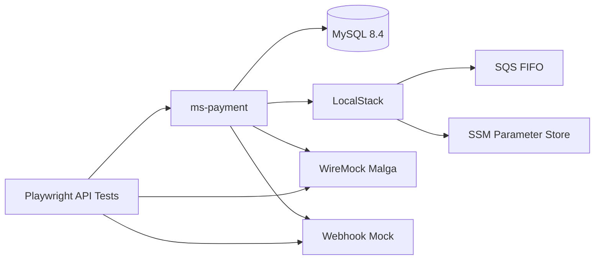

# Relatório técnico — projeto Playwright E2E do `ms-payment`

**Data:** 10/07/2026  
**Idioma:** Português (Brasil)  
**Projeto de testes:** `ms-payment-playwright-e2e`

## 1. Objetivo

Entregar uma suíte automatizada de testes API/BDD/E2E para o `ms-payment`, executável contra ambiente local totalmente controlado, HML e PROD, com proteção para impedir cenários destrutivos em produção.

A implementação prioriza a alteração do fluxo de cartão enviado à Malga: criação ou reutilização de customer, criação ou reutilização de card e criação da charge com `customerId`, `billing`, `paymentSource.sourceType=card`, `cardId` e `splitRules` condicional.

## 2. Fontes e evidências consideradas

- Especificação BDD/E2E anexada para a atualização do payload Malga e split.
- Story e task no Notion relacionadas ao split e à geração do relatório E2E/BDD.
- Pasta Google Drive `ms-payment`, incluindo `README.md`, `pom.xml`, `swagger.yaml`, relatórios técnicos e árvore `src`.
- `application.yaml` atual, que evidencia dependências de MySQL/Flyway, AWS SQS, AWS SSM e Malga.
- Relatórios anteriores de tokenização, consulta mascarada, status, captura e reconciliação.

### Limitação

A pasta do Drive expôs a árvore do repositório, porém nem todo arquivo Java foi recuperado integralmente como texto. Por isso, os testes foram desenhados para validar o comportamento observável da API e das integrações outbound, reduzindo acoplamento com detalhes internos.

## 3. Arquitetura da solução



O Playwright atua como cliente da API pública e, no modo local, também consulta a API administrativa do WireMock para validar as chamadas realizadas à Malga. Isso permite confirmar não apenas o status HTTP recebido pelo canal, mas o contrato outbound efetivamente emitido pelo `ms-payment`.

## 4. Estrutura do projeto

```text
ms-payment-playwright-e2e/
├── docker/
│   ├── localstack/init-aws.sh
│   ├── mysql/001-local.sql
│   └── wiremock/mappings/
├── docs/
│   ├── inventario-configuracao.md
│   ├── matriz-bdd-e2e.md
│   └── relatorio-tecnico-playwright-ms-payment.md
├── scripts/doctor-env.ts
├── src/
│   ├── clients/
│   ├── config/
│   ├── fixtures/
│   ├── helpers/
│   └── types/
├── tests/
│   ├── contract/
│   ├── e2e/
│   ├── resilience/
│   ├── security/
│   └── smoke/
├── docker-compose.yml
├── playwright.config.ts
└── package.json
```

## 5. Ambientes

### 5.1 Local

O perfil local sobe:

- MySQL 8.4 para persistência e migrations Flyway;
- LocalStack com SQS e SSM;
- três filas FIFO usadas pelo serviço;
- parâmetros SSM com credenciais fictícias da Malga;
- WireMock simulando customers, cards, charges, consulta e captura;
- receptor HTTP de webhook;
- aplicação `ms-payment`, por meio do profile Compose `app`.

O código do serviço alvo não foi copiado para o projeto E2E. O Compose usa `MS_PAYMENT_PROJECT_DIR`, permitindo manter os repositórios lado a lado e testar exatamente a branch desejada.

### 5.2 HML

O ambiente HML usa `.env.hml` e requer URL, `access_token`, `client_id` e merchant configurado. Os testes devem usar dados exclusivos por execução e evitar dependência de estado compartilhado.

### 5.3 PROD

O comando `test:prod` seleciona apenas cenários `@prod-safe`. Criação de pagamento, captura, void, alteração de merchant e simulação de falhas não devem receber essa tag.

## 6. Decisões técnicas

### Playwright API em vez de browser

O alvo é uma API backend. O `APIRequestContext` reduz custo, melhora determinismo e mantém recursos como tracing, relatório HTML, retries e JUnit.

### Factories de payload

Os payloads são gerados por execução com UUIDs para evitar colisão de `merchant_payment_id` e `merchant_order_id`.

### Validação do outbound com WireMock

Os testes consultam `POST /__admin/requests/find` para verificar:

- ordem e quantidade de chamadas;
- presença de `customerId` e `billing`;
- `sourceType=card` e `cardId`;
- ausência de `tokenId` na charge;
- inclusão ou omissão de `splitRules`.

### Configuração centralizada

`src/config/environment.ts` carrega `.env.<ambiente>`, valida tipos com Zod e fornece headers de autenticação. O arquivo falha cedo quando uma URL está inválida.

### Segurança

Credenciais reais não são versionadas. Exemplos usam valores fictícios e arquivos `.env` são ignorados. A suíte inclui asserções contra exposição de token, `cardId`, chaves e dados brutos de cartão.

## 7. Cobertura implementada

- health check local/HML/PROD seguro;
- rejeição de crédito sem billing;
- rejeição de card em PIX;
- rejeição de valor inválido;
- fluxo de crédito com split;
- crédito sem split;
- regressão PIX;
- retry da charge sem duplicar customer/card;
- verificação básica de dados sensíveis na resposta.

## 8. Extensões recomendadas

A estrutura está preparada para acrescentar:

- validação direta no MySQL dos IDs persistidos;
- retry após falha na criação do customer;
- retry após falha na criação do card;
- concorrência com a mesma chave idempotente;
- PATCH de provider com credenciais mascaradas;
- preservação de `options.defaultCategoryId`;
- validação da migration `V27`;
- captura total/parcial e webhook;
- validação de auditoria/logs por coleta de container logs.

## 9. Comandos operacionais

```bash
cp .env.local.example .env.local
npm install
npx playwright install --with-deps
npm run infra:up:app
npm run doctor:env
npm run test:local
npm run infra:down
```

## 10. Critério de conclusão

A entrega é considerada pronta quando:

1. `npm run typecheck` conclui sem erro;
2. os containers locais ficam saudáveis;
3. `doctor:env` valida alvo, WireMock e webhook mock;
4. testes P0 passam em ambiente local;
5. PROD executa somente `@prod-safe`;
6. relatórios HTML e JUnit são gerados como evidência.
