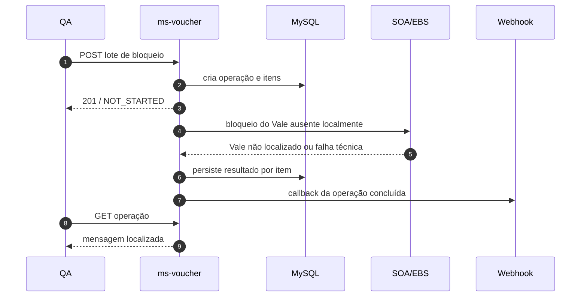

# Guia técnico de testes E2E e BDD — mensagem de Vale não localizado no `ms-voucher`

**Data:** 17/07/2026

**Projeto:** `ms-voucher`

**Branch de referência:** `issue/STRY0048887`

**Task:** `[task] issue wrong message ms-voucher`

**Mudança principal:** classificação do retorno conhecido de Vale inexistente como erro funcional `422.064`

**Público-alvo:** QA, desenvolvimento, sustentação e responsáveis pela homologação

## 1. Resumo executivo

Este guia define a estratégia BDD e o roteiro manual E2E para validar a correção do cenário em que um Vale não existe no MySQL do `ms-voucher` e o SOA/EBS também informa que ele não foi localizado.

Antes da correção, esse retorno funcional era convertido em erro técnico e o item do lote apresentava `status: ERROR` com a mensagem genérica `Erro interno do servidor.`. No snapshot atual do projeto, a implementação já contém:

- a chave funcional `Messages.VOUCHER_NOT_FOUND = "422.064"`;
- a mensagem PT-BR `O Vale {0} não foi localizado. Verifique o código informado.`;
- a mensagem em inglês `Voucher {0} was not found. Check the provided code.`;
- classificação estrita da assinatura externa `Erro - Vale <código> não localizado.`;
- preservação do fallback `500.000` para falhas técnicas ou respostas externas desconhecidas;
- testes unitários e de serviço para a classificação, persistência, localização e continuidade do lote.

O gate de homologação deve comprovar não somente a mensagem positiva, mas também que a correção não transforma falhas técnicas em erros funcionais, não interrompe os demais itens, não altera o contrato JSON e mantém a localização no `GET` e no webhook.

## 2. Fontes e evidências analisadas

### 2.1 Fontes funcionais e de contexto

- Task no Notion — issue wrong message ms-voucher
- Conversa original no Teams
- Resposta técnica enviada no Teams
- Projeto `ms-voucher` no Google Drive
- Relatório final da implementação
- Especificação da API de operações em lote

### 2.2 Evidências no código

- `VoucherService.java`: compara a mensagem externa com a assinatura conhecida, ignorando caixa e espaços externos, e lança `UnprocessableEntityException(422.064, código)` somente quando há correspondência.
- `SOAPIntegrateVoucherBlockClient.java`: converte resposta ou fault SOAP em `BlockVoucherClientException`, preservando mensagem e código externo quando disponíveis.
- `VoucherBatchOperationProcessingService.java`: persiste código e argumentos de exceções funcionais; demais exceções usam `500.000`.
- `Messages.java`, `messages_pt_BR.properties` e `messages_en.properties`: contêm a chave `422.064` e os textos localizados.
- `BlockVoucherTest.java`, `VoucherBatchOperationProcessingServiceTest.java` e `VoucherMessagesPtBrTest`: cobrem classificação, erro técnico, persistência, localização, placeholders e continuidade do lote.

### 2.3 Tratamento dos anexos desta solicitação

Os anexos disponibilizados nesta conversa são relatórios, Swagger e coleções Postman do `ms-payment`, além de uma referência à API Blip. Eles não descrevem os endpoints `POST/GET /voucher-batch-operations`, o bloqueio de Vale ou a integração SOAP do `ms-voucher`; por isso, não foram usados para definir resultados esperados deste plano.

## 3. Objetivo, escopo e fora de escopo

### 3.1 Objetivo

Comprovar que um Vale inexistente confirmado pelo SOA/EBS termina com item `ERROR` e mensagem funcional localizada, sem afetar a classificação de erros técnicos, a execução dos demais itens, o webhook ou o contrato público.

### 3.2 Em escopo

- `POST /voucher-batch-operations/block` e processamento assíncrono;
- `GET /voucher-batch-operations/{id}`;
- retorno do endpoint individual de bloqueio, quando exposto no ambiente;
- fallback de consulta ao SOA/EBS para Vale ausente no MySQL;
- chave funcional `422.064` e argumentos;
- mensagens PT-BR e inglês;
- override de idioma no `GET` e locale persistido no `POST`;
- webhook de conclusão;
- isolamento de itens em lote misto;
- manutenção de `500.000` para falhas inesperadas;
- ausência de dados internos no JSON público e de detalhes sensíveis na mensagem.

### 3.3 Fora de escopo

- alteração do XML ou do contrato do SOA/EBS;
- mudanças de schema ou migrations, pois a correção não cria nenhuma;
- regras completas de venda, reserva, bonificação ou cancelamento;
- testes de carga abrangentes do serviço;
- execução contra produção.

## 4. Modelo de risco e prioridades

| Prioridade | Significado | Regra de execução |
| --- | --- | --- |
| P0 | Bloqueia a liberação | Executar em toda homologação da correção. Qualquer falha reprova o build. |
| P1 | Regressão importante | Executar antes da promoção; falha exige análise formal e decisão do time. |
| P2 | Complementar | Executar quando o ambiente oferecer massa ou controle apropriado. |

Riscos principais:

1. retornar novamente `500.000` para um Vale realmente inexistente;
2. classificar indisponibilidade, timeout ou outra rejeição como `422.064`;
3. interromper o lote após o primeiro erro;
4. localizar a mensagem no idioma errado;
5. expor mensagem SOAP, stack trace, `messageCode` ou argumentos internos no contrato público;
6. variar a assinatura textual do legado entre ambientes e impedir o reconhecimento.

## 5. Arquitetura do teste E2E



Devem ser usados dois perfis de execução:

- **E2E real em HML:** valida rede, aplicação, MySQL, integração real com SOA/EBS, processamento assíncrono, persistência e `GET`/webhook.
- **E2E determinístico com stub do SOA:** obrigatório para falha técnica, assinatura divergente, variações de caixa/espaço e sucesso de Vale externo. O endpoint SOAP configurável deve apontar para WireMock, MockServer ou simulador equivalente, usando um XML aprovado do próprio projeto como fixture.

Não se deve inventar um XML SOAP. O stub deve partir de uma requisição/resposta já validada com o contrato do ambiente e alterar somente os campos necessários, como `resposta`, `descricaoResposta`, fault e identificador do Vale.

## 6. Pré-requisitos e massa de teste

### 6.1 Pré-requisitos

- build candidato implantado em ambiente isolado ou HML;
- Java 25 e Maven 3.9+ para a suíte local;
- acesso autorizado ao endpoint do `ms-voucher`;
- credenciais de HML fora de arquivos versionados e evidências;
- MySQL com migration de lote já existente e consumidor assíncrono ativo;
- SOA/EBS acessível para E2E real, ou endpoint reconfigurado para stub;
- coletor HTTP de webhook exclusivo para o teste;
- acesso aos logs com `correlationId`, sem necessidade de expor payloads sensíveis;
- `jq`, `curl` e utilitário `base64` na estação do executor;
- valores válidos de revenda, produto, canal, documento e telefone para HML.

Antes do teste, consultar `/voucher/v1/actuator/info` e registrar versão, commit, data de build e `dirty`. O artefato aprovado deve ser rastreável e preferencialmente apresentar `dirty=false`.

### 6.2 Catálogo de massa

| Identificador | Descrição | Origem | Uso |
| --- | --- | --- | --- |
| `MISSING_REAL` | Vale inexistente no MySQL e no SOA/EBS; exemplos observados: `1231212` e `ASDFGCR` | HML | Cenário principal real. Confirmar antes da execução que não passou a existir. |
| `VALID_LOCAL` | Vale local em estado bloqueável, com venda e dados relacionados válidos | HML | Sucesso e lote misto. É consumível; usar massa exclusiva. |
| `VALID_EXTERNAL` | Vale ausente localmente, mas reconhecido e bloqueável pelo SOA/EBS | HML controlada ou stub | Garante que a ausência local não gere falso `422.064`. |
| `INVALID_STATUS` | Vale conhecido em status não bloqueável, como `BONIFICADO` | HML | Regressão de erro funcional existente (`422.038`). |
| `MISSING_STUB` | Vale associado no stub à mensagem exata `Erro - Vale <código> não localizado.` | Stub | Classificação determinística. |
| `TECHNICAL_STUB` | Vale associado a timeout, HTTP 5xx, SOAP Fault ou conexão recusada | Stub | Preservação do erro técnico `500.000`. |
| `OTHER_CODE_2` | Resposta com código externo `2`, mas mensagem diferente, como Vale já bloqueado | Stub | Garante que o código genérico `2` não seja tratado isoladamente como Vale inexistente. |

Toda massa mutável deve ter responsável, estado inicial, data/hora de reserva e procedimento de descarte ou restauração. Não reutilizar o mesmo Vale bloqueável em execuções paralelas.

## 7. Matriz de cobertura

| ID | Cenário | Prioridade | Perfil | Resultado central |
| --- | --- | --- | --- | --- |
| E2E-001 | Vale inexistente em PT-BR | P0 | HML e stub | Item `ERROR`; mensagem `O Vale <código> não foi localizado...` |
| E2E-002 | Vale inexistente em inglês | P0 | HML ou stub | Item `ERROR`; mensagem `Voucher <código> was not found...` |
| E2E-003 | Override de idioma no `GET` | P0 | HML ou stub | Mesmo item alterna representação entre PT-BR e inglês |
| E2E-004 | `POST` sem `Accept-Language` | P1 | HML ou stub | Locale padrão `en-US` no `GET` sem header e no webhook |
| E2E-005 | Falha técnica real | P0 | Stub | Item `ERROR`; mensagem genérica localizada; sem `422.064` público |
| E2E-006 | Código externo `2` com outra mensagem | P0 | Stub | Não classifica como Vale inexistente |
| E2E-007 | Vale externo existente | P0 | HML controlada ou stub | Bloqueio prossegue; não retorna `422.064` |
| E2E-008 | Lote misto | P0 | HML ou stub | Erro de um item não impede os seguintes |
| E2E-009 | Webhook localizado e contrato público | P0 | HML ou stub | Callback único, mensagem correta, sem campos internos |
| E2E-010 | Regressão de status inválido | P1 | HML | Mantém mensagem funcional já existente; não vira `422.064` |
| E2E-011 | Caixa e espaços externos na assinatura | P1 | Stub | Mensagem conhecida ainda é reconhecida |
| E2E-012 | Assinatura apenas parecida | P0 | Stub | Não reconhece correspondência parcial; usa erro técnico |
| E2E-013 | Concorrência e isolamento | P1 | Stub | Cada mensagem contém somente seu próprio código |
| E2E-014 | Operação inexistente | P2 | HML | `GET` retorna `404`; contrato de consulta preservado |
| E2E-015 | Segurança e observabilidade | P0 | Todos | Sem stack trace, SOAP bruto, credenciais ou dados internos na API |

## 8. Especificação BDD em Gherkin

```gherkin
# language: pt
Funcionalidade: Informar corretamente que um Vale não foi localizado
  Como consumidor da API de operações em lote
  Quero receber uma mensagem funcional e localizada para um Vale inexistente
  Para corrigir o dado informado sem interpretar a ocorrência como falha interna

  Contexto:
    Dado que o ms-voucher candidato está disponível
    E que o processamento assíncrono de lotes está ativo
    E que os dados comuns de revenda, produto, canal e consumidor são válidos

  @P0 @e2e @pt-BR
  Cenário: Vale inexistente confirmado pelo SOA/EBS em português
    Dado que o código "1231212" não existe no MySQL
    E que o SOA/EBS responde "Erro - Vale 1231212 não localizado."
    Quando eu criar um lote com esse código e idioma "pt-BR"
    E aguardar a conclusão da operação
    Então a operação deve estar "COMPLETED"
    E o item "1231212" deve estar "ERROR"
    E a mensagem deve ser "O Vale 1231212 não foi localizado. Verifique o código informado."
    E a resposta não deve conter "Erro interno do servidor."

  @P0 @e2e @i18n
  Cenário: Relocalizar o mesmo erro no GET
    Dado que uma operação em PT-BR terminou com o erro funcional de Vale inexistente
    Quando eu consultar a operação com "Accept-Language: en-US"
    Então o item deve continuar "ERROR"
    E a mensagem deve ser "Voucher 1231212 was not found. Check the provided code."
    Quando eu consultar novamente com "Accept-Language: pt-BR"
    Então a mensagem deve voltar ao texto em português
    E o estado persistido da operação não deve ser alterado pelas consultas

  @P0 @e2e @negative
  Cenário: Falha técnica do SOA/EBS não é convertida em Vale inexistente
    Dado que o Vale não existe no MySQL
    E que o SOA/EBS apresenta timeout ou SOAP Fault não reconhecido
    Quando o lote for processado em PT-BR
    Então o item deve estar "ERROR"
    E a mensagem pública deve ser "Erro interno do servidor."
    E a mensagem pública não deve afirmar que o Vale não foi localizado

  @P0 @e2e @negative
  Cenário: Código externo genérico não determina a classificação
    Dado que o SOA/EBS responde com código "2"
    E que a mensagem externa é diferente da assinatura de Vale não localizado
    Quando o lote for processado
    Então o item deve permanecer classificado como erro inesperado
    E não deve retornar a mensagem de código funcional "422.064"

  @P0 @e2e @regression
  Cenário: Vale externo válido continua usando o fallback síncrono
    Dado que o Vale não existe no MySQL
    E que o SOA/EBS reconhece e bloqueia o Vale com sucesso
    Quando o lote for processado
    Então o item deve estar "COMPLETED"
    E não deve apresentar a mensagem de Vale não localizado

  @P0 @e2e @batch
  Cenário: Um Vale inexistente não interrompe os demais itens
    Dado um lote ordenado com um Vale inexistente, um Vale válido e um Vale em status inválido
    Quando o processamento assíncrono terminar
    Então todos os itens devem possuir resultado final
    E o Vale inexistente deve estar "ERROR" com a mensagem "422.064" localizada
    E o Vale válido deve estar "COMPLETED"
    E o Vale em status inválido deve manter sua mensagem funcional específica
    E a operação deve estar "COMPLETED"

  @P0 @e2e @webhook
  Cenário: Webhook usa o locale salvo e preserva o contrato público
    Dado que a operação foi criada com idioma "pt-BR" e webhook válido
    Quando todos os itens terminarem
    Então o webhook deve receber a operação concluída
    E o Vale inexistente deve conter a mensagem em português
    E os campos "messageCode", "messageArguments", "messageDetail" e "localeTag" não devem existir
    E uma consulta posterior em inglês não deve alterar o idioma já enviado ao webhook

  @P1 @component @classifier
  Esquema do Cenário: Normalização segura da assinatura conhecida
    Dado que o SOA/EBS devolve a mensagem externa <mensagem>
    Quando o código "1231212" for processado
    Então o resultado funcional esperado deve ser <resultado>

    Exemplos:
      | mensagem                                      | resultado |
      | "Erro - Vale 1231212 não localizado."        | "422.064" |
      | "  Erro - Vale 1231212 não localizado.  "    | "422.064" |
      | "ERRO - VALE 1231212 NÃO LOCALIZADO."        | "422.064" |
      | "Vale 1231212 não localizado"                | "500.000" |
      | "Erro - Vale 9999999 não localizado."        | "500.000" |
      | "O vale já foi bloqueado"                    | "500.000" |
```

Observação: `messageCode` é contexto interno e não deve aparecer na API. Nos cenários que citam `422.064` ou `500.000`, a comprovação direta do código deve ser feita em teste de componente, banco controlado ou evidência de log sanitizada; no E2E público, a asserção é feita pelo texto e pelo status.

## 9. Preparação da execução manual

### 9.1 Variáveis de ambiente

```bash
export API_BASE='https://<host-hml>/<base-path>'
export AUTH_HEADER='Authorization: Bearer <token-hml>'
export CLIENT_ID_HEADER='client_id: <client-id-hml>'
export WEBHOOK_URL='https://<coletor-exclusivo>/voucher-batch'

export CASE_ID='QA-422064-20260717-001'
export VALIDATION_CHANNEL='<canal-valido>'
export CODE_RESALE='<revenda-valida>'
export ADDRESS_VALIDATION='<endereco-valido>'
export DOCUMENT_RESALE='<documento-revenda-valido>'
export CODE_PRODUCT='<produto-valido>'
export CONSUMER_DOCUMENT='<cpf-teste-valido>'
export CONSUMER_PHONE='<telefone-teste-valido>'
export MISSING_REAL='1231212'

export WEBHOOK_B64="$(printf '%s' "$WEBHOOK_URL" | base64 | tr -d '\n')"
```

Os nomes dos headers de autenticação podem variar conforme o gateway. Ajustar somente essa parte com base na configuração oficial de HML; não registrar token ou `client_id` nos arquivos de evidência.

### 9.2 Payload-base

```bash
jq -n \
  --arg caseId "$CASE_ID" \
  --arg validationChannel "$VALIDATION_CHANNEL" \
  --arg codeResale "$CODE_RESALE" \
  --arg addressValidation "$ADDRESS_VALIDATION" \
  --arg documentResale "$DOCUMENT_RESALE" \
  --arg codeProduct "$CODE_PRODUCT" \
  --arg consumerDocument "$CONSUMER_DOCUMENT" \
  --arg consumerPhoneNumber "$CONSUMER_PHONE" \
  --arg webhookUrl "$WEBHOOK_B64" \
  --arg voucher "$MISSING_REAL" \
  '{
    caseId: $caseId,
    validationChannel: $validationChannel,
    codeResale: $codeResale,
    addressValidation: $addressValidation,
    documentResale: $documentResale,
    userType: "CONSUMIDOR_FINAL",
    codeProduct: $codeProduct,
    orderLatitude: "-23.550520",
    orderLongitude: "-46.633308",
    consumerDocument: $consumerDocument,
    consumerPhoneNumber: $consumerPhoneNumber,
    webhookUrl: $webhookUrl,
    vouchers: [$voucher]
  }' > request-422064.json
```

Usar latitude e longitude aprovadas para a revenda de teste. Os valores acima são apenas exemplos de formato.

### 9.3 Criar a operação

```bash
curl --silent --show-error \
  --dump-header post.headers \
  --output post-response.json \
  --write-out '%{http_code}\n' \
  --request POST "$API_BASE/voucher-batch-operations/block" \
  --header "$AUTH_HEADER" \
  --header "$CLIENT_ID_HEADER" \
  --header 'Content-Type: application/json' \
  --header 'Accept-Language: pt-BR' \
  --data @request-422064.json

jq . post-response.json
export OPERATION_ID="$(jq -r '.id' post-response.json)"
```

Critérios imediatos:

- HTTP `201 Created`;
- `id` não vazio;
- `operation = BLOCK`;
- estado inicial normalmente `NOT_STARTED` — também é aceitável já observar `RUNNING` ou estado final em ambiente rápido;
- um item para cada código enviado;
- ausência de stack trace e campos internos de mensagem.

### 9.4 Aguardar o processamento

```bash
for attempt in $(seq 1 30); do
  curl --silent --show-error \
    --output get-response.json \
    --request GET "$API_BASE/voucher-batch-operations/$OPERATION_ID" \
    --header "$AUTH_HEADER" \
    --header "$CLIENT_ID_HEADER" \
    --header 'Accept-Language: pt-BR'

  STATUS="$(jq -r '.status' get-response.json)"
  printf 'tentativa=%s status=%s\n' "$attempt" "$STATUS"

  if [ "$STATUS" = 'COMPLETED' ] || [ "$STATUS" = 'ERROR' ]; then
    break
  fi
  sleep 2
done

jq . get-response.json
```

O tempo limite deve refletir o SLA de HML. Se a operação permanecer em `NOT_STARTED` ou `RUNNING`, registrar defeito de processamento/ambiente antes de avaliar a mensagem.

## 10. Execução e asserções por cenário

### 10.1 E2E-001 — Vale inexistente em PT-BR

Executar o fluxo da seção 9 com `MISSING_REAL`.

```bash
jq -e --arg code "$MISSING_REAL" '
  .status == "COMPLETED" and
  any(.items[];
    .voucherCode == $code and
    .status == "ERROR" and
    .message == ("O Vale " + $code + " não foi localizado. Verifique o código informado."))
' get-response.json
```

Reprovar se o texto for `Erro interno do servidor.`, contiver `{0}`, usar outro código de Vale ou retornar HTTP 5xx no `GET`.

### 10.2 E2E-002 e E2E-003 — inglês e override no `GET`

```bash
curl --silent --show-error \
  --output get-en.json \
  "$API_BASE/voucher-batch-operations/$OPERATION_ID" \
  --header "$AUTH_HEADER" \
  --header "$CLIENT_ID_HEADER" \
  --header 'Accept-Language: en-US'

jq -e --arg code "$MISSING_REAL" '
  any(.items[];
    .voucherCode == $code and
    .status == "ERROR" and
    .message == ("Voucher " + $code + " was not found. Check the provided code."))
' get-en.json

curl --silent --show-error \
  --dump-header get-pt.headers \
  --output get-pt-again.json \
  "$API_BASE/voucher-batch-operations/$OPERATION_ID" \
  --header "$AUTH_HEADER" \
  --header "$CLIENT_ID_HEADER" \
  --header 'Accept-Language: pt-BR'

grep -i '^Vary:.*Accept-Language' get-pt.headers
```

Confirmar que `id`, estados, datas e quantidade de itens são iguais entre as duas representações; apenas os textos localizáveis podem mudar.

### 10.3 E2E-004 — ausência de `Accept-Language`

Criar uma nova operação removendo o header do `POST`, aguardar a conclusão e consultar sem header. O texto esperado é inglês, pois o fallback documentado é `en-US`. O webhook dessa operação também deve usar inglês.

### 10.4 E2E-005, E2E-006, E2E-011 e E2E-012 — cenários controlados do classificador

No ambiente com stub, configurar respostas por código:

| Código de teste | Resposta do stub | Esperado no item PT-BR |
| --- | --- | --- |
| `MISS001` | mensagem exata de não localizado | `O Vale MISS001 não foi localizado. Verifique o código informado.` |
| `MISS002` | mesma mensagem em caixa diferente e com espaços externos | mesma classificação funcional |
| `PARTIAL1` | texto parecido, mas sem a assinatura exata | `Erro interno do servidor.` |
| `OTHER02` | código externo `2` com outra mensagem | `Erro interno do servidor.` |
| `FAULT01` | SOAP Fault/timeout/HTTP 5xx | `Erro interno do servidor.` |

Além do JSON, verificar nos logs sanitizados:

- `MISS001`/`MISS002`: log informativo de Vale não localizado, sem stack trace como erro inesperado;
- demais códigos: erro técnico com causa disponível para diagnóstico interno;
- a API nunca devolve o texto bruto do stub, fault, endpoint, credencial ou stack trace.

### 10.5 E2E-007 — Vale externo reconhecido

Garantir que `VALID_EXTERNAL` não exista no MySQL, mas seja aceito pelo SOA/EBS ou pelo stub. Criar um lote unitário e validar:

- chamada síncrona externa ocorreu;
- item final `COMPLETED`;
- mensagem de sucesso localizada;
- ausência de `422.064` e de `Erro interno do servidor.`.

Esse cenário impede a regressão de encerrar o fluxo apenas porque a consulta local retornou vazia.

### 10.6 E2E-008 e E2E-010 — lote misto e regressão

Criar `request-mixed.json` com a ordem:

```json
"vouchers": ["<MISSING_REAL>", "<VALID_LOCAL>", "<INVALID_STATUS>"]
```

Validar:

- a resposta contém exatamente três itens e preserva a associação entre código e resultado;
- `MISSING_REAL`: `ERROR` e mensagem `422.064` localizada;
- `VALID_LOCAL`: `COMPLETED` e mensagem de sucesso;
- `INVALID_STATUS`: `ERROR` com a mensagem funcional de disponibilidade/status já existente, nunca `422.064`;
- a operação termina `COMPLETED`, pois todos os itens foram processados, ainda que alguns tenham erro;
- o segundo e o terceiro itens foram executados mesmo após erro no primeiro.

### 10.7 E2E-009 — webhook e contrato

No coletor de webhook, validar:

- uma chamada `POST` para a URL decodificada;
- `Content-Type: application/json`;
- mesmo `operationId` criado pela API;
- estado final e todos os itens;
- mensagem no locale salvo no `POST`;
- ausência de `messageCode`, `messageArguments`, `messageDetail` e `localeTag` em qualquer nível;
- nenhum callback adicional indevido para a mesma conclusão.

Asserção sugerida sobre o payload salvo como `webhook.json`:

```bash
jq -e '
  ([paths | map(tostring) | join(".")] | map(
    contains("messageCode") or
    contains("messageArguments") or
    contains("messageDetail") or
    contains("localeTag")
  ) | any) | not
' webhook.json
```

### 10.8 E2E-013 — concorrência e isolamento

Com stub determinístico, criar duas operações simultâneas, cada uma com 10 códigos inexistentes distintos. Validar:

- todas terminam dentro do SLA;
- cada item contém exatamente o próprio código no texto;
- não há placeholder `{0}`;
- não há mensagem de um Vale associada a outro item;
- nenhum lote fica travado por erro individual.

### 10.9 E2E-014 — consulta de operação inexistente

```bash
curl --silent --show-error \
  --output not-found.json \
  --write-out '%{http_code}\n' \
  "$API_BASE/voucher-batch-operations/00000000-0000-0000-0000-000000000000" \
  --header "$AUTH_HEADER" \
  --header "$CLIENT_ID_HEADER" \
  --header 'Accept-Language: pt-BR'
```

Esperado: HTTP `404`, sem impacto em operações existentes e sem detalhes internos.

## 11. Validação automatizada antes do E2E

Executar a partir da raiz real do repositório `ms-voucher`:

```bash
java -version
mvn -version

mvn -Dtest=BlockVoucherTest,VoucherBatchOperationProcessingServiceTest,VoucherMessagesPtBrTest test
mvn clean test
mvn clean install
```

Critérios:

- Java 25;
- todos os testes focados verdes;
- suíte completa sem falhas, erros ou testes ignorados inesperadamente;
- build instalável gerado;
- número de testes não inferior ao baseline da entrega. O relatório da implementação registrou `325` testes, `0` falhas, `0` erros e `0` ignorados;
- relatório JaCoCo gerado e sem redução não justificada nas classes alteradas.

Cobertura mínima obrigatória em teste de código:

- correspondência exata, caixa diferente e espaços externos;
- código do Vale diferente dentro da mensagem;
- código externo `2` com mensagem diferente;
- fault ou texto técnico desconhecido;
- causa original preservada no erro interno;
- persistência de `422.064` e argumento;
- resolução PT-BR e inglês;
- ausência de `{0}`;
- segundo item processado após o erro do primeiro;
- não acionamento do enriquecimento específico de `422.038` para `422.064`.

## 12. Evidências obrigatórias

Para cada execução, anexar:

1. ambiente, data/hora, executor e identificador do build;
2. commit/versão do `/actuator/info`;
3. ID da operação e `correlationId`;
4. payload sanitizado do `POST`;
5. status HTTP e resposta inicial;
6. resposta final em PT-BR e inglês;
7. payload do webhook;
8. evidência do stub para cenários controlados;
9. trecho de log sanitizado que demonstre a rota funcional ou técnica;
10. resultado dos comandos Maven e relatório de testes;
11. massa utilizada e estado final de cada Vale;
12. defeitos encontrados com esperado, obtido e passos de reprodução.

Remover das evidências tokens, `client_id`, credenciais, documentos reais, telefones reais, payload SOAP completo e URLs internas sensíveis.

## 13. Critérios de aceite e saída

A entrega é aprovada quando:

- todos os cenários P0 passam;
- não há regressão P0/P1 aberta sem aceite formal;
- Vale inexistente confirmado retorna item `ERROR` com texto funcional correto em PT-BR e inglês;
- falhas técnicas e mensagens externas desconhecidas continuam genéricas para o consumidor;
- lote misto processa todos os itens;
- Vale externo válido continua bloqueável;
- `GET` respeita `Accept-Language` e envia `Vary: Accept-Language`;
- webhook usa o locale do `POST`;
- contrato público permanece inalterado;
- não há placeholder, stack trace, mensagem SOAP bruta ou dado sensível na API;
- suíte automatizada e build estão verdes;
- artefato testado é o mesmo promovido.

A entrega deve ser reprovada imediatamente se:

- o cenário principal ainda retornar `Erro interno do servidor.`;
- timeout/fault for apresentado como Vale inexistente;
- um erro interromper os demais itens;
- o código de outro Vale aparecer na mensagem;
- campos internos forem expostos;
- o build testado não for rastreável.

## 14. Riscos residuais e recomendações

- A classificação depende de texto do legado. Se o SOA/EBS alterar pontuação, prefixo ou redação, o retorno voltará de forma segura para `500.000`, mas o defeito funcional poderá reaparecer. Monitorar a frequência do fallback técnico no bloqueio síncrono.
- O código externo `2` é genérico e não deve ser usado isoladamente. Caso o SOA/EBS forneça futuramente um código exclusivo e estável, migrar o classificador e adicionar teste de contrato.
- O E2E real depende de massa que continue inexistente. Confirmar o estado imediatamente antes do teste.
- O relatório de implementação registrou `ORA-12514` no Oracle HML. Embora essa task não dependa diretamente da consulta Oracle para classificar o retorno SOAP, falhas de infraestrutura podem afetar o health check ou outras massas de regressão; registrar separadamente defeito de ambiente e defeito funcional.
- O endpoint individual também passa a receber a exceção funcional `422.064`. Se estiver publicado no ambiente, executar um smoke adicional e validar HTTP `422` com o formato padrão de erros do serviço.

## 15. Glossário

| Termo | Significado | Explicação |
| --- | --- | --- |
| API | Application Programming Interface | Contrato HTTP usado pelos consumidores do `ms-voucher`. |
| BDD | Behavior-Driven Development | Técnica que descreve comportamento esperado em cenários Dado/Quando/Então. |
| E2E | End-to-End | Teste que atravessa o fluxo completo entre API, processamento, persistência e integrações. |
| HML | Homologação | Ambiente controlado usado para validar o candidato antes de produção. |
| SOA | Service-Oriented Architecture | No contexto do projeto, integração legada usada para operações de Vale. |
| EBS | Oracle E-Business Suite | Sistema corporativo de retaguarda integrado ao fluxo de Vale. |
| SOAP | Simple Object Access Protocol | Protocolo XML usado na comunicação com o sistema legado. |
| Stub | Simulador controlado | Substitui a integração externa para produzir respostas determinísticas. |
| Locale | Configuração de idioma/região | Define se a mensagem será resolvida em PT-BR ou inglês. |
| Gate | Critério de liberação | Conjunto mínimo de verificações que precisa passar antes da promoção do build. |

## 16. Conclusão

O plano cobre o caminho funcional corrigido e, principalmente, suas fronteiras de segurança: correspondência textual estrita, preservação de erros técnicos, fallback síncrono para Vale externo, isolamento do lote, localização e contrato público. A combinação de testes automatizados, E2E determinístico com stub e validação real em HML oferece evidência suficiente para promover a correção sem mascarar indisponibilidades ou criar falsos resultados de Vale inexistente.

---
