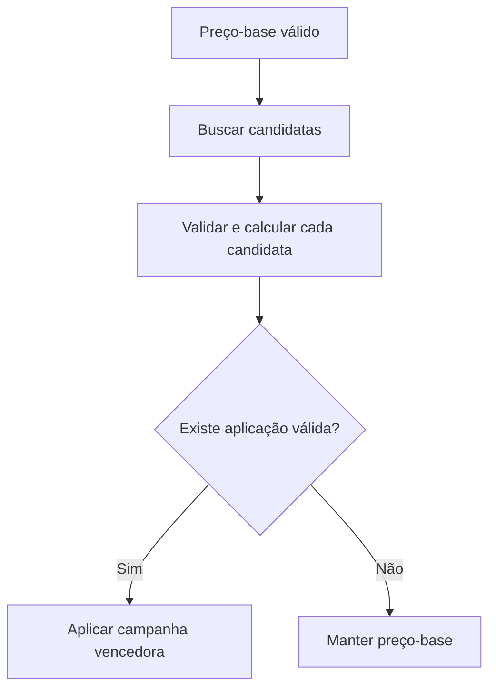

# Relatório de desenvolvimento — fallback para o preço-base quando nenhuma campanha for aplicável

**Projeto:** `ms-voucher`  
**Tarefa:** `[task] Fix the price rule to get the default price when a campaing do not match with the criterias`  
**Data da análise:** 03/08/2026  
**Idioma:** Português (Brasil)  
**Branch de referência:** `issue/STRY0046423`  
**Situação:** diagnóstico e guia de implementação; nenhuma alteração de código foi executada neste trabalho.

## 1. Resumo executivo

O erro funcional `422.065` é um efeito colateral introduzido na validação defensiva de campanhas em `PriceService.findBestPricingRule(...)`. O método consulta campanhas ativas e compatíveis com os filtros básicos, descarta as que possuem definição ou resultado financeiro inválido e, quando todas são descartadas, lança `UnprocessableEntityException`:

```java
if (validApplications.isEmpty()) {
    throw new UnprocessableEntityException(
            Messages.PRICING_RULE_WITHOUT_VALID_RESULT,
            priceResponse.getCodeProduct());
}
```

Esse comportamento está incorreto para `GET /prices`. A consulta existe para devolver a oferta vigente do cliente e é usada pela validação e geração do vale. Campanha é um benefício episódico e opcional. Portanto, se nenhuma campanha puder ser aplicada — porque não existe campanha ativa, nenhum filtro corresponde ou todas as candidatas são inválidas — a aplicação deve manter a oferta já construída antes da campanha:

1. usar `netPriceProduct`, quando houver preço líquido vigente;
2. caso contrário, usar `price`;
3. não preencher `appliedPricingRuleCode` nem `appliedPricingRulePayloadHash`;
4. responder normalmente, sem `422.065`.

A correção mínima e recomendada fica restrita a `PriceService` e seus testes. Não é necessário mudar controller, repository, DTO público, banco, setup, importação de campanhas, cálculo de desconto, precedência, FEPAS ou versionamento de preço efetivo.

## 2. Evidências analisadas

### 2.1 Notion

As três páginas obrigatórias foram pesquisadas e lidas:

- [`[task] Analyze issue with the new Campain Price`](https://app.notion.com/p/3aeb3def3e7c80a3996efd49777e9137): registra a correção de compatibilidade do payload de campanha, mantendo `tipoValor` opcional e inferido por `novoValor` ou `decrescimo`.
- [`[task] Fix the precification rule issue`](https://app.notion.com/p/3acb3def3e7c807b89b4c21dd29e7de8): consolida o cálculo de desconto, seleção de campanhas, propagação ao FEPAS e limites do setup.
- [`[task] Fix the price rule to get the default price when a campaing do not match with the criterias`](https://app.notion.com/p/3b1b3def3e7c801684b7eed16af4b530): contém a reprodução atual, com HTTP 422 e código `422.065` para o produto `0110035`.

A story [`[Vale] Novo fluxo de precificação - Campanhas`](https://app.notion.com/p/37cb3def3e7c8062b73df9c57fb6a4e9) também determina que a campanha se sobrepõe temporariamente ao preço normal e que, ao fim da vigência, o preço normal volta a ser retornado. Isso confirma que o preço-base é a regra permanente e a campanha é uma transformação opcional.

### 2.2 Teams

Na [conversa com Fábio](https://teams.cloud.microsoft/l/chat/19:124ef588-86b0-48b5-8a69-b29707084de1_4d35ac12-f224-476b-aac8-ef3cf2b78aee@unq.gbl.spaces/conversations?context=%7B%22contextType%22%3A%22chat%22%7D), foi demonstrado que:

- `GET /prices` é a consulta do cliente, não um endpoint exclusivo de campanha;
- o retorno é usado para descobrir o preço do gás e validar se há campanha ativa;
- a ausência de preço quebra o fluxo de geração do vale;
- quando a campanha não se aplica, deve ser devolvido o preço padrão.

Na [conversa do grupo com Marcelo e Fábio](https://teams.cloud.microsoft/l/chat/19:567ac97996fb4ef584ceaef0e2025f68@thread.v2/conversations?context=%7B%22contextType%22%3A%22chat%22%7D), Marcelo confirmou explicitamente que:

- sem campanha, o sistema deve retornar o valor padrão;
- campanha é um evento esporádico, não contínuo;
- a indisponibilidade do preço-base nunca fez parte da regra aprovada;
- o `422.065` foi um efeito colateral da implementação, não um requisito funcional.

### 2.3 Código atual no Google Drive

Foi percorrida recursivamente a [árvore `src` do `ms-voucher`](https://drive.google.com/drive/folders/1Mm3ojFZ0MGVijsmog-ZjA2rwNk2_zteD): 119 diretórios, 656 arquivos e 495 fontes Java.

Arquivos centrais verificados:

- [`PriceService.java`](https://drive.google.com/file/d/1kDgEp9KwiOEEKrtql_XEtqkTjDqimlsF/view): contém a origem do erro e todo o fallback já necessário em `applyPricingRule(...)`.
- [`GestaoVgPricingRuleRepository.java`](https://drive.google.com/file/d/1bQRPFUi05wBZ52hLpeqP6QhZGN1UsYKW/view): busca somente regras ativas, vigentes e compatíveis com os filtros disponíveis.
- [`GetPricesTest.java`](https://drive.google.com/file/d/1J8javcVXk16UqDCIREoSfQMfsx1oW5ag/view): possui três expectativas que hoje consolidam o comportamento incorreto de lançar exceção.
- [`PricesController.java`](https://drive.google.com/file/d/1bhlnb7rKAjQnE45Qjf5tdtkrVvcwvCUD/view) e [`PricesControllerTest.java`](https://drive.google.com/file/d/1GWI0aWAkGjUxXDWZCN2_hWr3u7su1fgF/view): não contêm a regra defeituosa e não precisam ser alterados.
- [`Messages.java`](https://drive.google.com/file/d/1eLNuze5bzeFd6QFaJ-P3F__BSrQHs-nf/view), [`messages_pt_BR.properties`](https://drive.google.com/file/d/1wCEY47_HQ2UDNc7_T4fXuIyFASO005Do/view) e [`messages_en.properties`](https://drive.google.com/file/d/1kcSfOSRZjome4zHy7qsoTauN4-3KmJCW/view): definem o código e a mensagem `422.065`; após o ajuste, ficarão sem uso neste fluxo.

O anexo `Playright-Github-Repository.txt` contém apenas o endereço do repositório [`FernandoAvanzo/PlaywrightSwitchCase`](https://github.com/FernandoAvanzo/PlaywrightSwitchCase). Ele deve ser usado como destino da regressão E2E. O conteúdo do repositório não foi disponibilizado no anexo.

## 3. Regra de negócio correta

### 3.1 Definição do preço de fallback

O termo “preço padrão” deve ser interpretado como a oferta vigente antes da campanha, já produzida por `PriceResponse.valueOf(...)`:

```text
precoDeFallback = netPriceProduct != null ? netPriceProduct : price
```

Esse detalhe evita uma regressão adicional: retornar sempre `price` poderia remover um preço líquido legítimo já carregado no relacionamento do distribuidor.

### 3.2 Matriz de decisão

| Estado da oferta | Campanhas encontradas | Aplicações válidas | Resultado |
|---|---:|---:|---|
| Preço-base válido | Nenhuma | Nenhuma | HTTP 200 com preço-base |
| Preço-base válido | Existem, mas nenhum filtro corresponde | Nenhuma | HTTP 200 com preço-base |
| Preço-base válido | Candidatas retornadas, todas inválidas | Nenhuma | HTTP 200 com preço-base e observabilidade |
| Preço-base válido | Pelo menos uma válida | Uma ou mais | Aplicar a vencedora pelo menor preço final e desempates vigentes |
| Preço-base inválido ou ausente | Qualquer estado | Qualquer estado | Preservar as validações já existentes para preço/vínculo inválido |
| Requisição ou distribuidor inválido | Não aplicável | Não aplicável | Preservar o erro funcional já existente |

### 3.3 Invariantes que não mudam

- `novoValor` continua sendo desconto absoluto.
- `decrescimo` continua sendo desconto percentual.
- `acrescimo` continua inválido.
- Limites do setup continuam sendo aplicados.
- Preços nulos, não positivos ou maiores que a oferta de entrada continuam sendo rejeitados como aplicações de campanha.
- Entre aplicações válidas, continua vencendo o menor preço final; os desempates permanecem especificidade e `codigoRegra`.
- Quando uma campanha válida for aplicada, seus metadados continuam chegando ao estado efetivo e ao FEPAS.

## 4. Causa raiz técnica

O fluxo correto já existe até o ponto de seleção:



No código atual, o ramo `Não` foi dividido indevidamente:

- lista do repository vazia → `Optional.empty()` → preço-base;
- lista não vazia, mas todas descartadas → `422.065`.

Essa distinção é técnica, não funcional. Para o consumidor de `GET /prices`, ambos significam a mesma coisa: não existe campanha aplicável à oferta atual.

### 4.1 Por que o primeiro tratamento pareceu correto

A decisão original foi defensiva e tinha uma motivação válida: impedir que uma campanha persistida com definição inconsistente fosse silenciosamente ignorada e evitar que um preço incorreto chegasse ao FEPAS/PDV. Ela foi adicionada no mesmo conjunto de mudanças que:

- corrigiu o cálculo absoluto e percentual;
- passou a validar regras legadas;
- descartou resultados nulos ou não positivos;
- levou a campanha vencedora até o estado efetivo/FEPAS.

O problema não está nas validações. O erro foi transformar a ausência de uma aplicação promocional válida em indisponibilidade da oferta principal. Isso mistura duas responsabilidades:

- **integridade da campanha:** deve ser garantida na importação, no setup e pela observabilidade defensiva;
- **disponibilidade do preço:** deve ser garantida pela oferta-base quando nenhuma campanha puder enriquecê-la.

O `422` também não é adequado nesse caso: segundo a [RFC 9110](https://www.rfc-editor.org/rfc/rfc9110.html#section-15.5.21), esse status representa instruções semanticamente impossíveis de processar. A requisição de preço continua processável porque existe uma representação comercial válida sem campanha. A mesma RFC define `GET` como transferência da representação atualmente selecionada do recurso ([seção 9.3.1](https://www.rfc-editor.org/rfc/rfc9110.html#section-9.3.1)).

## 5. Solução recomendada

### 5.1 Alteração funcional mínima

Em `PriceService.findBestPricingRule(...)`, remover o lançamento de `422.065` e devolver `Optional.empty()` quando nenhuma candidata gerar aplicação válida.

Implementação sugerida, preservando observabilidade:

```java
List<PricingRuleApplication> validApplications = candidateRules.stream()
        .map(rule -> calculateApplication(currentFinalPrice, rule, discountLimits))
        .flatMap(Optional::stream)
        .toList();

if (validApplications.isEmpty()) {
    log.warn(
            "No valid pricing campaign applies to product {}. Returning the current base offer. candidateRuleCodes={}",
            priceResponse.getCodeProduct(),
            candidateRules.stream()
                    .map(GestaoVgPricingRuleDomain::getCodigoRegra)
                    .toList());
    return Optional.empty();
}

return validApplications.stream().min(this::compareApplications);
```

Uma forma ainda mais compacta é retornar diretamente o resultado de `min(...)`. A API de `Stream.min(...)` já devolve `Optional.empty()` quando o stream está vazio, conforme a [documentação do Java SE](https://docs.oracle.com/en/java/javase/25/docs/api/java.base/java/util/stream/Stream.html#min(java.util.Comparator)). A versão explícita acima é preferível neste caso porque preserva um evento agregado de observabilidade para dados persistidos inconsistentes.

### 5.2 Ajustes de documentação interna

Atualizar os Javadocs:

- `getPricesFromDatabase(...)`: remover a afirmação de que “nenhuma campanha produz resultado válido” gera `UnprocessableEntityException`.
- `findBestPricingRule(...)`: documentar que retorna vazio tanto quando não há candidatas quanto quando todas são inválidas.
- `calculateApplication(...)`: preservar a descrição de descarte defensivo.
- `applyPricingRule(...)`: tornar explícito que `Optional.empty()` mantém a oferta já existente.

Opcionalmente, renomear a variável local `eligibleRules` para `candidateRules`. O repository já verificou elegibilidade contextual, mas a validade da definição e do resultado financeiro ainda será avaliada em memória. A mudança de nome reduz a ambiguidade sem alterar contrato.

### 5.3 Tratamento do código `422.065`

Existem duas opções seguras:

1. **Hotfix mínimo:** manter a constante e as traduções, mesmo sem uso, para reduzir o diff.
2. **Limpeza no mesmo commit:** remover `PRICING_RULE_WITHOUT_VALID_RESULT` de `Messages.java` e as chaves `422.065` dos dois bundles, depois de confirmar com busca global que não há outro uso.

Recomendação: usar a primeira opção no hotfix e abrir limpeza separada. A prioridade é restaurar o fluxo; remover um código interno não agrega valor funcional imediato.

## 6. Inventário de impacto

| Arquivo | Método/área | Ação | Obrigatório? |
|---|---|---|---:|
| `PriceService.java` | `findBestPricingRule(...)` | Trocar exceção por `Optional.empty()` e registrar fallback | Sim |
| `PriceService.java` | Javadocs de `getPricesFromDatabase(...)`, `findBestPricingRule(...)` e `applyPricingRule(...)` | Alinhar contrato documentado | Sim |
| `GetPricesTest.java` | cenários que esperam `UnprocessableEntityException` para campanhas descartadas | Passar a esperar preço-base sem metadados de campanha | Sim |
| `GetPricesTest.java` | novos cenários de ausência, não correspondência e mistura de regras | Cobrir regressão | Sim |
| `tests/prices/prices.spec.ts` no Playwright | regressão HTTP/E2E | Validar `GET /prices` e geração de vale sem campanha aplicável | Recomendado |
| `Messages.java` e bundles de idioma | `422.065` | Manter no hotfix ou remover em limpeza separada | Não |

### 6.1 Arquivos que não devem ser alterados

- `GestaoVgPricingRuleRepository.java`: a consulta atual já devolve vazio quando nenhum filtro corresponde.
- `PricesController.java`: o controller apenas delega ao serviço.
- `PriceResponse.java`: o modelo já suporta preço-base e metadados opcionais de campanha.
- `GestaoVgPricingRuleImportService.java`: a barreira de entrada deve continuar rejeitando campanhas inválidas.
- `VoucherSetupService` e `PricingDiscountLimitsProvider`: limites permanecem vigentes.
- `EffectivePriceStateService`, `SeFepasService` e `SeFepasUtils`: já recebem a oferta devolvida por `PriceService`; no fallback, devem trabalhar com a oferta-base.
- migrations, entidades e tabelas: não há mudança de persistência.
- Swagger/OpenAPI: o contrato de resposta não muda; apenas deixa de ocorrer um erro indevido.

## 7. Testes Java a alterar ou criar

### 7.1 Alterar expectativas existentes em `GetPricesTest`

| Teste atual | Alteração sugerida |
|---|---|
| `shouldRejectLegacyPercentageIncreasePricingRuleForCnpjSearch` | Renomear para `shouldReturnBasePriceWhenLegacyIncreaseRuleIsIgnored`; esperar sucesso, preço-base e metadados de campanha nulos |
| `shouldRejectPricingRuleThatProducesNonPositivePrice` | Renomear para `shouldReturnBasePriceWhenEveryCandidateProducesNonPositivePrice`; esperar preço-base |
| `shouldApplyTheCurrentSetupLimitToTheWholePriceQuery` | Renomear para `shouldReturnBasePriceWhenCampaignExceedsCurrentSetupLimit`; continuar verificando uma única leitura do provider e esperar preço-base |

### 7.2 Criar cenários unitários

1. `shouldReturnBasePriceWhenNoActivePricingRuleExists`
   - repository devolve lista vazia;
   - retorno contém o produto e o preço vigente;
   - metadados de campanha permanecem nulos.

2. `shouldReturnBasePriceWhenNoPricingRuleMatchesTheOfferContext`
   - simular ausência de correspondência contextual;
   - confirmar que a oferta não é removida.

3. `shouldReturnExistingNetPriceWhenNoCampaignCanBeApplied`
   - relacionamento contém `price=100` e `netPriceProduct=90`;
   - fallback deve ser `90`, não `100`.

4. `shouldApplyValidCampaignWhenOtherCandidatesAreInvalid`
   - uma candidata inválida e uma válida;
   - a válida deve ser aplicada normalmente.

5. `shouldKeepBasePriceMetadataEmptyWhenCampaignFallsBack`
   - confirmar `appliedPricingRuleCode == null`;
   - confirmar `appliedPricingRulePayloadHash == null`.

6. `shouldKeepOtherProductsAvailableWhenOneProductHasNoValidCampaign`
   - consulta de catálogo com mais de um produto;
   - um produto recebe campanha válida e outro usa preço-base;
   - a lista completa continua disponível.

### 7.3 Regressões que devem continuar passando

- desconto absoluto do cenário `codigoRegra=563`;
- desconto percentual sobre o preço líquido;
- menor preço final entre campanhas válidas;
- desempate por especificidade;
- desempate por maior `codigoRegra`;
- domingo mapeado para `diaDaSemana=1`;
- caminho Oracle sem consulta a campanhas locais;
- estado efetivo e tag 404 do FEPAS.

## 8. Cobertura BDD e E2E Playwright

### 8.1 Cenário BDD principal

```gherkin
Funcionalidade: Consultar o preço vigente quando nenhuma campanha se aplica

  Cenário: Retornar o preço padrão sem campanha aplicável
    Dado que o cliente 4756 e o endereço 5953124 possuem um preço vigente para o produto 0110035
    E não existe campanha válida que corresponda ao contexto da consulta
    Quando o cliente consulta GET /prices
    Então a API deve responder HTTP 200
    E deve retornar o produto 0110035 com o preço vigente antes da campanha
    E não deve informar código nem hash de campanha aplicada
    E não deve responder com o código 422.065
```

### 8.2 Cenários E2E recomendados

Adicionar em `tests/prices/prices.spec.ts` do projeto Playwright:

- `PRICE-016`: sem campanha ativa → retorna preço-base.
- `PRICE-017`: campanha ativa fora do dia/período/CNPJ/produto → retorna preço-base.
- `PRICE-018`: candidatas persistidas, mas todas defensivamente inválidas → retorna preço-base e HTTP 200.
- `PRICE-019`: candidata inválida junto de candidata válida → aplica a válida.
- `PRICE-020`: após `dataFim`, a mesma oferta volta ao preço-base.
- `PRICE-021`: consulta sem campanha aplicável ainda permite gerar o vale no fluxo consumidor.

Os cenários devem usar massa isolada e restaurar/inativar as campanhas criadas pela API oficial. Não editar diretamente o banco de HML para montar a condição.

## 9. Guia de implementação passo a passo

### Etapa 1 — reproduzir e fixar a evidência

1. Executar o `GET /prices` com `customerId=4756`, `customerSiteId=5953124` e `Accept-Language=pt-br`.
2. Registrar `correlationId`, status HTTP, código `422.065` e produto `0110035`.
3. Consultar as campanhas retornadas pelo repository para identificar por que cada candidata foi descartada.
4. Registrar somente códigos de regra e motivos; não incluir dados sensíveis em logs ou evidências.

### Etapa 2 — aplicar o hotfix em `PriceService`

1. Em `findBestPricingRule(...)`, manter a busca de candidatas.
2. Manter `calculateApplication(...)` e `isValidPricingRuleDefinition(...)` sem mudança funcional.
3. Quando `validApplications` estiver vazio, registrar warning agregado e retornar `Optional.empty()`.
4. Manter `compareApplications(...)` sem mudança.
5. Atualizar os Javadocs indicados.

### Etapa 3 — ajustar os testes Java

1. Converter os três testes negativos listados na seção 7.1 em cenários de fallback.
2. Criar os cenários da seção 7.2.
3. Validar explicitamente preço, `netPriceProduct` e metadados de campanha.
4. Garantir que o repository e o provider sejam chamados uma única vez por contexto esperado.

### Etapa 4 — executar regressão focada

```bash
mvn -q -Dtest=GetPricesTest,PricesControllerTest test
mvn -q -Dtest=EffectivePriceStateServiceTest,SeFepasServicePricingTest,SeFepasUtilsTest test
```

### Etapa 5 — executar a suíte completa

```bash
mvn -q test
mvn -q -DskipTests compile
git diff --check
```

### Etapa 6 — executar Playwright

No projeto indicado pelo anexo:

```bash
npm run test:prices
npm run test:pricing-fix
```

Se esses scripts tiverem nomes diferentes no checkout atual, usar `npx playwright test tests/prices/prices.spec.ts` e atualizar o README do projeto de testes.

### Etapa 7 — validar manualmente em HML

1. Confirmar health check do `ms-voucher`.
2. Executar o mesmo `GET /prices` usado por Fábio.
3. Confirmar HTTP 200 e presença do produto `0110035`.
4. Confirmar que o valor retornado é o preço vigente antes da campanha.
5. Criar uma campanha válida e confirmar aplicação do desconto.
6. Alterar o contexto para que a campanha não corresponda e confirmar retorno ao preço-base.
7. Encerrar/inativar a campanha e confirmar novamente o preço-base.
8. Gerar um vale usando a oferta de fallback.
9. Executar regressão FEPAS controlada e confirmar que a tag 404 recebe o mesmo preço-base.

### Etapa 8 — observabilidade pós-deploy

Monitorar durante pelo menos um ciclo completo de cotação e geração de vale:

- quantidade de respostas `422.065`, que deve chegar a zero nesse fluxo;
- quantidade de fallbacks por ausência de aplicação válida;
- códigos de regras descartadas e motivo agregado;
- taxa de sucesso de `GET /prices`;
- geração de vales sem campanha ativa;
- mudanças inesperadas de versão FEPAS.

O fallback não deve ocultar degradação de dados. Recomenda-se criar métrica ou log estruturado específico, por exemplo `PRICING_CAMPAIGN_FALLBACK_TO_BASE`, com produto e códigos de regra, sem CNPJ completo.

## 10. Critérios de aceite

- `GET /prices` responde HTTP 200 quando existe preço vigente e nenhuma campanha é aplicável.
- O produto `0110035` é retornado com o preço vigente antes da campanha.
- `422.065` não é emitido apenas porque campanhas candidatas foram descartadas.
- `netPriceProduct` tem precedência sobre `price` no fallback.
- Metadados de campanha ficam nulos quando nenhuma campanha é aplicada.
- Uma candidata inválida não impede outra candidata válida de vencer.
- Cálculo e precedência das campanhas válidas permanecem inalterados.
- Importação e setup continuam rejeitando dados inválidos.
- Geração de vale funciona sem campanha ativa.
- FEPAS recebe o preço efetivo correto, inclusive o preço-base no fallback.
- Testes focados, suíte Maven e testes Playwright passam.
- Nenhuma migration nem mudança de contrato público é incluída no hotfix.

## 11. Riscos e mitigação

| Risco | Mitigação |
|---|---|
| Fallback esconder campanha persistida inválida | Manter logs individuais, warning agregado e métrica operacional |
| Retornar `price` e perder desconto líquido já vigente | Usar a oferta já montada; não reconstruir preço no fallback |
| Alterar precedência entre campanhas válidas | Não modificar `compareApplications(...)` |
| Regressão FEPAS | Rodar testes de estado efetivo e tag 404 e validar HML controlado |
| Teste E2E competir com campanhas existentes | Usar massa reservada, código único e limpeza por inativação oficial |
| Remoção prematura do código `422.065` aumentar o diff | Manter recursos no hotfix e limpar separadamente |

## 12. Conclusão

A mudança correta não é relaxar a validação das campanhas; é restaurar a hierarquia funcional da oferta. O preço-base existe independentemente de campanha. A campanha, quando válida e aplicável, apenas transforma essa oferta temporariamente.

O hotfix deve converter o estado “nenhuma aplicação válida” em `Optional.empty()`, permitindo que `applyPricingRule(...)` mantenha o `PriceResponse` original. Essa solução é pequena, preserva todas as proteções anteriores, restaura a compatibilidade do fluxo do Gestão VG e evita que a geração do vale dependa artificialmente da existência de uma promoção.

## 13. Fontes

### Fontes corporativas

- [Notion — Analyze issue with the new Campain Price](https://app.notion.com/p/3aeb3def3e7c80a3996efd49777e9137)
- [Notion — Fix the precification rule issue](https://app.notion.com/p/3acb3def3e7c807b89b4c21dd29e7de8)
- [Notion — Fix the price rule to get the default price](https://app.notion.com/p/3b1b3def3e7c801684b7eed16af4b530)
- [Notion — Story Novo fluxo de precificação](https://app.notion.com/p/37cb3def3e7c8062b73df9c57fb6a4e9)
- [Teams — conversa com Fábio](https://teams.cloud.microsoft/l/chat/19:124ef588-86b0-48b5-8a69-b29707084de1_4d35ac12-f224-476b-aac8-ef3cf2b78aee@unq.gbl.spaces/conversations?context=%7B%22contextType%22%3A%22chat%22%7D)
- [Teams — conversa do grupo com Marcelo e Fábio](https://teams.cloud.microsoft/l/chat/19:567ac97996fb4ef584ceaef0e2025f68@thread.v2/conversations?context=%7B%22contextType%22%3A%22chat%22%7D)
- [Google Drive — projeto `ms-voucher`](https://drive.google.com/drive/folders/184PaSJreDCSOG2iSDO6jlEMTSW_AjnHu)
- [Anexo — repositório Playwright](https://github.com/FernandoAvanzo/PlaywrightSwitchCase)

### Fontes técnicas externas

- [RFC 9110 — semântica do método GET](https://www.rfc-editor.org/rfc/rfc9110.html#section-9.3.1)
- [RFC 9110 — 422 Unprocessable Content](https://www.rfc-editor.org/rfc/rfc9110.html#section-15.5.21)
- [Java SE 25 — `Stream.min`](https://docs.oracle.com/en/java/javase/25/docs/api/java.base/java/util/stream/Stream.html#min(java.util.Comparator))

## Glossário

| Termo | Significado | Explicação |
|---|---|---|
| API | Interface de Programação de Aplicações | Contrato usado por sistemas para trocar requisições e respostas. |
| BDD | Desenvolvimento Orientado por Comportamento | Forma de descrever testes pela regra de negócio usando Dado/Quando/Então. |
| E2E | Ponta a ponta | Teste que percorre o fluxo real entre consumidor, API e dependências relevantes. |
| FEPAS | Contexto corporativo de distribuição de preços ao terminal/PDV | Fluxo que recebe do `ms-voucher` a tabela de preços efetivos. |
| PDV | Ponto de Venda | Terminal que utiliza o preço distribuído para a operação do vale. |
| Fallback | Comportamento alternativo seguro | Neste caso, preservar o preço-base quando nenhuma campanha puder ser aplicada. |
| Preço-base | Oferta vigente antes da campanha | É `netPriceProduct` quando disponível; caso contrário, `price`. |
| Candidata | Campanha retornada pela busca contextual | Ainda precisa passar pelas validações de definição e resultado financeiro. |
| `Optional.empty()` | Ausência explícita de valor no Java | Representa que não há campanha aplicável sem transformar isso em erro. |
| HTTP 422 | Unprocessable Content | Status para conteúdo semanticamente impossível de processar; não cabe quando o preço-base pode ser devolvido. |
